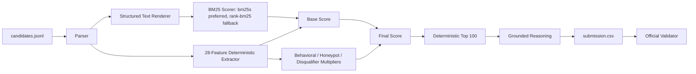

# Redrob Candidate Ranker Architecture

## 1. Goal

Rank the top 100 candidates for the Redrob **Senior AI Engineer - Founding Team** JD while satisfying CPU-only, no-network, no-GPU, sub-5-minute reproduction constraints.

## 2. Pipeline



## 3. Core Design

- BM25 is a compact lexical signal, not the final judge.
- The 28-feature matrix encodes JD intent: production retrieval/ranking, product-company history, Python/evaluation, seniority, location, availability, and trap avoidance.
- Multipliers enforce recruiter reality: a technically strong but unreachable or impossible profile should fall sharply.
- Reasoning is generated from actual profile fields and feature triggers only.

## 4. Scoring

```text
base_score = weighted(BM25 + skill + career + experience + logistics features)
final_score = base_score
            * behavioral_multiplier
            * honeypot_multiplier
            * disqualifier_multiplier
```

Hard honeypot traps receive `honeypot_multiplier = 0.0`. Softer JD disqualifiers compound through `disqualifier_multiplier`.

## 5. Guardrails

The detector penalizes:

- Salary min > max.
- Expert core skill with zero duration.
- Multiple current jobs.
- Impossible education timeline.
- Career timeline inconsistency.
- Endorsement inflation with low profile completeness.
- Non-target title with heavy AI/retrieval descriptions.
- Consulting-only, pure-research, CV/speech/robotics-primary, keyword-stuffed, or title-hopping profiles.

## 6. Reproducibility

Official command:

```bash
python rank.py --candidates ./candidates.jsonl --out ./submission.csv
```

No hosted LLM/API calls are made during ranking. The optional `bm25s` backend is preferred for speed, but `rank-bm25` fallback keeps the ranker runnable in restricted environments.
