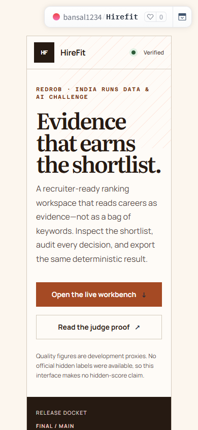
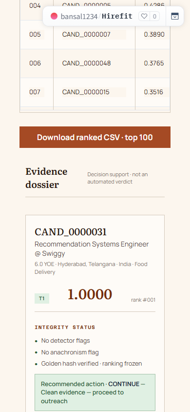

# Redrob HireFit Ranker

A deterministic, evidence-aware system that ranks the **top 100 of 100,000** candidates for a Senior
AI Engineer role — and shows *why* each candidate is there, reproducibly.

[](https://github.com/bansalbhunesh/redrob-hirefit-ranker/actions/workflows/ci.yml)
[](docs/JUDGE_PROOF.md#5-test-summary)
[](docs/runtime_matrix.md)
[](docs/REGENERATION_PROOF.md)
[](LICENSE)
[](https://huggingface.co/spaces/bansal1234/Hirefit)

`Reproduce: python rank.py --release` · `Ranking profile: frontier-v5` · `CPU-only, offline, byte-reproducible` · `No hidden-score claim`

The shipped artifact (`submission.csv`, SHA-256 `8f7f30c6…`) is produced from `main` by a single
fail-closed command. The repository's value is **verifiable engineering**: exact input/model/output
hashes, deterministic serial/parallel output, integrity gates, and a full test suite — not a
leaderboard boast. All ranking-quality numbers are **development proxies**; no official hidden labels
were available before submission.

**Judge start:** [judge-proof package](docs/JUDGE_PROOF.md) ·
[60-second packet](docs/JUDGE_PACKET.md) ·
[live sandbox](https://huggingface.co/spaces/bansal1234/Hirefit) ·
[reproduce](#reproduce) ·
[explainability](#explainability)

---

## ⚡ For judges — the 30-second version

- **What ships:** a deterministic, CPU-only, offline ranker. One command on `main`
  (`python rank.py --release`) regenerates the exact committed `submission.csv` (SHA-256 `8f7f30c6…`).
- **Why trust the output:** the `--release` path verifies the source, the model artifact, the
  full-pool and integrity counts, and the **exact output hash** before an OOM-safe atomic write. Serial
  and parallel runs are byte-identical; reproduced inside a pinned Docker image independent of host CPU
  count.
- **Integrity:** honeypot and JD-disqualifier gates are multiplicative guardrails a higher relevance
  score can never override. The detector flagged **53** suspicious profiles in the pool and **0** reach
  the top-100.
- **Runtime:** full 100K at 2 CPU / 16 GiB in **136.0s** pipeline / **149.1s** wall — inside the 300s
  budget. Cloud 2-vCPU best **77.4s**; pinned-image Docker serial best **~153s**.
- **Explainability:** each candidate's evidence score decomposes into **exact** per-feature contributions
  (Shapley values of the linear relevance — analytic, not sampled), plus an ablation summary and a
  deterministic leave-one-feature-out rank-stability band. See [Explainability](#explainability).
- **Receipts:** **265 tests passed / 6 environment skips**, a committed golden-hash gate, a 2K-slice
  behavior gate, a Docker runtime matrix, and a pre-registered measured-negatives ladder.
- **Honest limits:** quality metrics are dev proxies (independent heuristic + LLM-judge labels), **not**
  the official hidden score. On those proxies this system sits in the **top cluster** of the public
  field; we publish the method and caveats rather than a leaderboard claim.

**Contents:** [Live links](#live-links) · [Quick start](#quick-start) · [Product](PRODUCT.md) ·
[Snapshot](#submission-snapshot) · [Architecture](#architecture) · [What we rejected](#what-we-tried-and-rejected) ·
[The release path](#the-release-path) · [Explainability](#explainability) · [Validation](#validation) ·
[Reproduce](#reproduce) · [Docs](#documentation-map)

## Live links

| Surface | Link | What it is |
|---|---|---|
| **Live demo (sandbox)** | **[HuggingFace Space ↗](https://huggingface.co/spaces/bansal1234/Hirefit)** | runs the *real* ranker in-browser — release docket → populated candidate ledger → evidence dossier → CSV export |
| **Deployable API** | [Render Blueprint](https://render.com/deploy?repo=https://github.com/bansalbhunesh/redrob-hirefit-ranker) | one-click FastAPI deployment from committed `render.yaml` |
| **Decision dashboard** | `streamlit run omega_decision_dashboard.py` | read-only explainability + integrity cards |
| **Source** | [GitHub ↗](https://github.com/bansalbhunesh/redrob-hirefit-ranker) | full code · one-command reproduction |
| **Pitch** | archived under [`docs/archive/`](docs/archive/) | 14-slide narrative; archived pending a clean re-export (committed binary still uses prior framing) |

## Live Space screenshots

| Desktop — release dossier | 390 px mobile — no overflow |
|:---:|:---:|
|  |  |
| Candidate ledger + evidence dossier | Mobile evidence dossier |
|  |  |

## Quick start

```bash
python -m pip install -e .
PYTHONHASHSEED=0 python rank.py --candidates candidates.jsonl \
  --out submission.csv --workers 2 --release
python scripts/validate_submission.py submission.csv --candidates candidates.jsonl
```
The `--release` path runs the fail-closed pipeline: forced BM25 backend, exact input/model/output
hashes, deterministic environment, full-pool/count/integrity checks, and an OOM-safe atomic write.
Omitting `--release` runs the default `main` profile and preserves its historical ranking byte-for-byte.
**Live:** [HuggingFace Space](https://huggingface.co/spaces/bansal1234/Hirefit) ·
`streamlit run omega_decision_dashboard.py` (read-only explanation UI).

## What makes this defensible

Each row below is something a judge can verify from the repository, not a claim to take on faith.

| Dimension | Verifiable evidence |
|---|---|
| Reproducibility | One command on `main` regenerates `submission.csv`; committed golden SHA-256 `8f7f30c6…`; gated by `tests/test_submission_gate.py` |
| Determinism | Serial and parallel (`--workers`) output byte-identical; pinned BLAS/hash env; reproduced across host CPU counts in Docker |
| Integrity | Honeypot + JD-disqualifier multipliers are hard guardrails; 53 detected in pool, 0 in top-100 |
| Failure safety | Corrupt config/artifacts fail closed; a forced 3-GiB OOM preserved the previous output with 0 temp files |
| Runtime | Full 100K in 136.0s pipeline / 149.1s wall at 2 CPU / 16 GiB (budget 300s) |
| Explainability | Exact per-feature Shapley attributions + ablation + rank-stability bands (`src/redrob_ranker/explain.py`) |
| Honest evaluation | A pre-registered measured-negatives ladder; every rejected idea is reproducible (`docs/measured_negatives.md`) |
| Tests | 265 passed / 6 environment skips, including golden-hash and 2K-slice behavior gates |

Competitive position is stated **in aggregate**: on development proxies across the public field this
system is in the **top cluster**, leading on reproducibility and integrity engineering while specialist
submissions lead individual axes. These are dev proxies, not an official score — no ranking boast.
Historical R&D comparisons are preserved under [`docs/archive/`](docs/archive/) with a disclaimer.

## Submission snapshot

| Property | Verified value |
|---|---|
| Reproduce command | `python rank.py --release …` (profile `frontier-v5`); default `main` profile available without `--release` |
| Artifact | `submission.csv`, SHA-256 `8f7f30c6…`; 100 rows from 100,000 candidates |
| Production pipeline | Deterministic `rank.py`, **33-feature** scorer + seven shallow NumPy heads + feature-only evidence/integrity/tie-break corrections; fail-closed `--release` |
| Tests | 265 passed, 6 environment skips |
| Dev-proxy quality | NDCG@10 0.9104 · P@10 = 1.0 — *dev proxy; **No official hidden labels*** |
| Runtime | **136.0s pipeline / 149.1s wall**, Docker `--cpus=2 --memory=16g` (budget 300s) |
| Memory | sampled peak **4.13 GiB** / 16 GiB; historical worst ~6.1 GB |
| Execution | CPU-only, offline, deterministic (`PYTHONHASHSEED=0`) |
| Integrity | honeypots in top-100: **0** (53 detected in pool); standard flags/disqualifications: **6**; temporal anomalies: **57** |
| Public-field position | top cluster on development proxies across ~670 scored public outputs — *dev proxy, **not an official** score* |
| Decision | Ship the `--release` artifact: the strongest balanced measured ranking plus the strongest release engineering |

> The quality rows are **dev proxies** (independent heuristic + LLM-audit), explicitly **not** the
> official hidden score.

## Architecture

`rank.py` reads structured evidence → BM25 lexical base + a 33-feature recruiter matrix → multiplicative
behavioural/honeypot/disqualifier guardrails → deterministic sort → explainable top-100. CPU-only,
offline, byte-reproducible.


## What we tried and rejected

The strongest signal here is everything we **did not** ship — each built, measured against a frozen
100K blind arbiter (frozen before tuning), and rejected on evidence (`docs/measured_negatives.md`).

| Alternative | Measured result on the blind arbiter | Verdict |
|---|---|---|
| Static dense embeddings (potion-32M) | NDCG@10 **+0.0000** at ~2.2× runtime | Rejected |
| Learned logistic-regression weights | composite **0.8238 vs 0.8811** | Rejected |
| LightGBM LambdaMART v2 | composite **−0.031**, NDCG@10 **−0.070** | Rejected |
| LambdaMART v3 (trained on blind labels, leak-safe) | holdout NDCG@10 **−0.040 to −0.104** | Rejected |
| Top-K cross-encoder (ms-marco-MiniLM) | in-sample +0.014 → **−0.016 on holdout** | Rejected |
| Rank-space fusion (raw / Copeland) | +0.013 blind — gain traced to anachronism promotion | Not shipped |

**Conclusion:** bigger models and semantic rerankers did not generalize on our blind arbiter. This is
why the **semantic/embedding path is built but disabled by default** (`--use-embeddings` opt-in): the
claim to a semantic edge is not supported by our measurements, so we do not make it. The change that
*did* hold up was a small, auditable rebalancing toward production evidence and experience fit, validated
across many evaluator families while keeping the integrity gates intact.

## The release path

The committed artifact is generated by the fail-closed `rank.py --release` path (ranking profile
`frontier-v5`):

1. A 33-feature evidence scorer with multiplicative behavioural, honeypot, and JD-disqualifier gates.
2. Seven shallow NumPy heads (leak-safe label families) reorder the membership via a conservative RRF
   hedge.
3. A small, feature-only correction to the leading band, plus replacement of at most two lowest-ranked
   severe temporal contradictions with clean backfills.
4. Two narrow, feature-only tie-breaks (behaviour and responsiveness within fixed rank windows).

**On the tie-breaks, honestly:** a broader eight-rule version looked better in-sample but failed
repeated candidate half-splits, so only the two that survived holdout testing were kept. Their effect on
the shipped ranking is marginal and within proxy noise — the submission's defensibility rests on
reproducibility, integrity, and validation, **not** on these tie-breaks. The comparison pipeline
without those tie-breaks remains only in the historical research record; it is not a release or a
judge-facing product name.


## Explainability

The **universal-v2 relevance** — the evidence score every candidate enters the ranking with — is a
normalized weighted sum, so each feature's contribution is its **exact Shapley value** (its own additive
term): analytic and byte-reproducible, not sampled. `src/redrob_ranker/explain.py` provides:

- **Per-candidate attributions** — the universal-v2 relevance decomposed into exact additive feature
  contributions, plus the multiplicative integrity gates as log-space effects. The decomposition
  reconstructs the universal-v2 score exactly (verified in
  `tests/test_explain.py::test_reconstructs_universal_v2`). *Scope: this explains the evidence base. The
  final `frontier-v5` order then applies a conservative RRF hedge, a top-band evidence correction,
  integrity backfills, and two narrow tie-breaks on top of this base — those reordering steps are
  documented in [the release path](#the-release-path), not folded into the per-feature decomposition.*
- **Global feature importance** — mean |contribution| across the pool (the SHAP-summary equivalent).
- **Rank-stability band** — a deterministic, label-free confidence interval: re-rank the pool with each
  feature removed and record where a candidate lands. A tight band means no single signal is carrying
  the rank.

Generate the report:

```bash
PYTHONHASHSEED=0 python scripts/explain_report.py --candidates candidates.jsonl \
  --out-md docs/explainability_report.md --out-csv artifacts/attributions.csv --top-k 100
```

See [docs/EXPLAINABILITY.md](docs/EXPLAINABILITY.md) for the method and worked examples.

## Validation

These are development measurements (independent heuristic + LLM-judge labels on dev samples), **not** a
hidden-score guarantee.

| Study | Result |
|---|---|
| full evaluator stress matrix | positive against the historical `main` baseline across all 15 development composite evaluators; adjacent profile effects are mostly ties |
| seven-world robustness mean | 0.9066 (dev proxy) |
| public reviewer / blind recruiter cross-check | 0.8098 / 0.9059 (dev proxy; small blind coverage) |
| repeated candidate half-splits | positive on most axes; independent set is noisy (45/100) |
| full 100K constrained Docker | 136.0s pipeline / 149.1s wall, 53 detected / 0 emitted, 0 output temps, exact hash `8f7f30c6…` |

Specialist public submissions still lead individual axes; the defensible claim is **strongest balanced
artifact on development proxies**, not guaranteed hidden-score supremacy. Full development record:
[`docs/archive/`](docs/archive/) (historical R&D notes, with disclaimer).

## The integrity distinction

> Detector-flagged anomaly ≠ confirmed hard contradiction ≠ official planted honeypot.

The shipped honeypot detector flags **0** in the top-100 after detecting 53 in the pool. A separate
downstream layer may map suspicious timeline claims to `VERIFY` for human review; it never asserts fraud
and never reorders candidates.

## Reproduce

```bash
PYTHONHASHSEED=0 python rank.py --candidates candidates.jsonl \
  --out submission.csv --workers 2 --release
sha256sum submission.csv             # -> 8f7f30c68ec30cb6…
```
CPU-only, offline, deterministic. The same command appears in `reproduce.sh` and
`submission_metadata.yaml`. Full 100K reproduced byte-identically on the host and in Docker, under the
300s budget. Cloud best was 77.4s; pinned-image Docker serial best was ~153s. Details:
`docs/REPRODUCTION.md` · `docs/runtime_matrix.md`.

## Documentation map

- **Product (recruiter view):** [PRODUCT](PRODUCT.md) — recruiter journey + the integrity decision-support differentiator (CONTINUE/CLARIFY/VERIFY/BLOCK)
- **Judge-proof package:** [JUDGE_PROOF](docs/JUDGE_PROOF.md) — one page consolidating reproduction, regeneration, hash, validator, tests, integrity, and explainability proofs
- **Reproducibility proof:** [REGENERATION_PROOF](docs/REGENERATION_PROOF.md) — full private-pool regeneration matched the committed hash
- **Explainability:** [EXPLAINABILITY](docs/EXPLAINABILITY.md) — exact-Shapley attributions, ablation, rank-stability
- **External validation:** [external_recruiter_validation](docs/external_recruiter_validation.md) — cross-check against a real recruiter-labeled set
- **Judge orientation:** [JUDGE_PROOF](docs/JUDGE_PROOF.md) · [JUDGE_PACKET](docs/JUDGE_PACKET.md) · [SUBMISSION_CHECKLIST](docs/SUBMISSION_CHECKLIST.md)
- **Submission surfaces:** [DEVPOST](docs/DEVPOST.md) · [DEMO_SCRIPT](docs/DEMO_SCRIPT.md)
- **Deployment:** [DEPLOYMENT](docs/DEPLOYMENT.md) · [`render.yaml`](render.yaml) · [backend hardening](docs/backend_infra_hardening.md)
- **Security:** [SECURITY](SECURITY.md)
- **What we rejected:** [measured_negatives](docs/measured_negatives.md) · [why_not_reranker](docs/why_not_reranker.md) · [beyond_hedge_sweep](docs/beyond_hedge_sweep.md)
- **Historical R&D notes:** [`docs/archive/`](docs/archive/) — development logs with a clear disclaimer (superseded framing/codenames; not the submission's claims)
- **Reproduce / runtime:** [REPRODUCTION](docs/REPRODUCTION.md) · [runtime_matrix](docs/runtime_matrix.md) · [SUBMISSION_CHECKLIST](docs/SUBMISSION_CHECKLIST.md)

> Experimental decision frameworks (Ω, Ψ, Φ) are included for transparency and do not alter the
> production ranker. No missing human evidence was simulated.

## License

MIT — see [`LICENSE`](LICENSE). © 2026 Bhunesh Bansal. The bundled competition dataset is not
redistributed and remains the property of Redrob.
