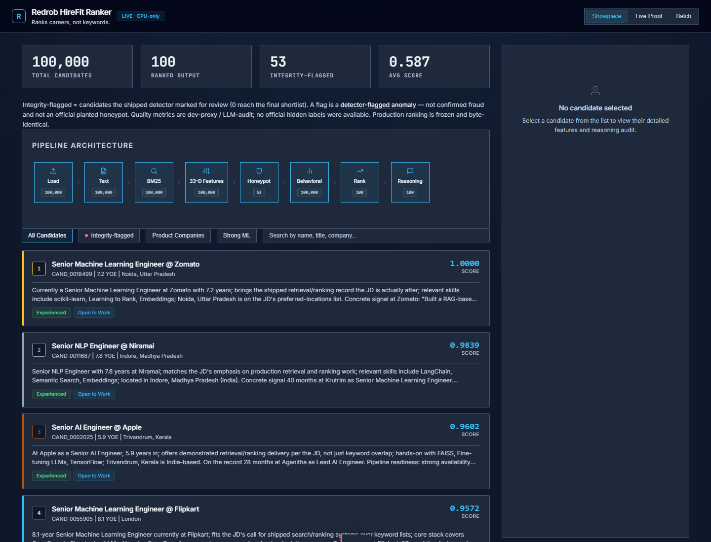
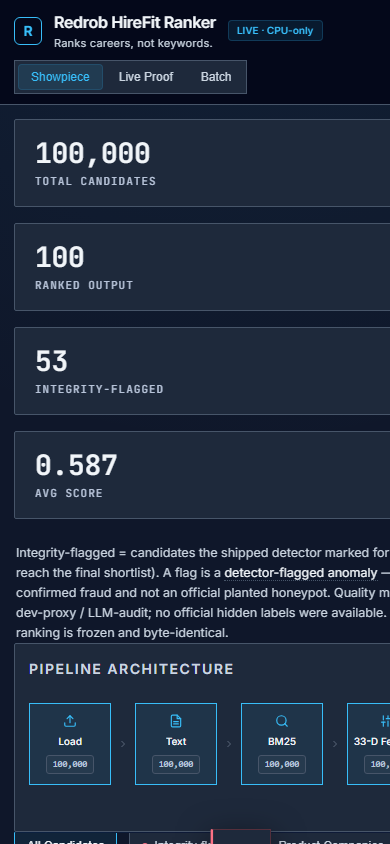
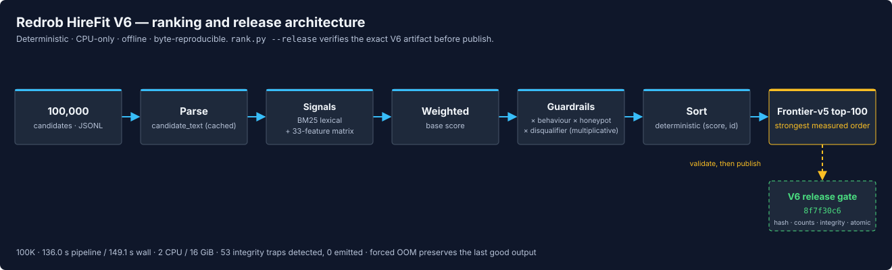
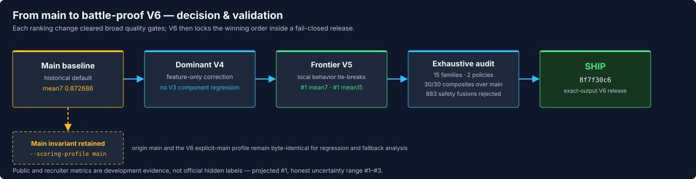

# Redrob HireFit Ranker

A deterministic, evidence-aware system that ranks the **top 100 of 100,000** candidates for a Senior
AI Engineer role — with receipts for *why* this ranking is the one to ship.

[](#)
[](#)
[](#)
[](#)
[](#)
[](#)
[](LICENSE)
[](https://huggingface.co/spaces/bansal1234/Hirefit)

`Release: V6 battle-proof` · `Ranking core: frontier-v5` · `No hidden-score claim`

`V6 result:` the strongest measured ranking is now wrapped in a fail-closed release: exact input,
model, environment, counts, integrity, and output hashes are verified before an OOM-safe atomic
publish. The ranking remains the proven frontier-v5 order; the shipping system is V6. See the
[`battle-proof audit`](docs/v6_battleproof_audit.md) and
[`challenge positioning`](docs/CHALLENGE_POSITIONING.md).

**Judge start:** [60-second packet](docs/JUDGE_PACKET.md) ·
[live sandbox](https://huggingface.co/spaces/bansal1234/Hirefit) ·
[pitch PDF](docs/HireFit_Ranker_Redrob_POLISHED.pdf) ·
[public-field scorecard](docs/PUBLIC_FIELD_SCORECARD.md) ·
[deployment guide](docs/DEPLOYMENT.md)

---

## ⚡ For judges — the 30-second version

- **What ships:** deterministic, CPU-only **V6 battle-proof release** (`8f7f30c6`), with the frontier-v5 ranking core and no competitor code, candidate IDs, fingerprints, or public ranks in production.
- **Measured quality:** V6 wins **30/30 composites versus main** across 15 label families and two missing-label policies. It scores **0.9066 mean7**, **0.9104 mean15**, **0.8098 reviewer**, **0.9059 blind recruiter**, and **0.8842 H2**.
- **Public field:** **#1 / 673** on the broad seven-judge mean, **#1 / 100** across the revalidated strongest-union mean15, and **#3 / 322** on equal four-axis balance. No measured public output dominates V6 across H2 + mean7 + reviewer + blind.
- **Runtime and integrity:** the final full-100K Docker release at 2 CPU / 16 GiB completed in **136.0s pipeline / 149.1s wall**, detected all **53 honeypots**, emitted **0**, left **0** output temps, and reproduced the exact hash.
- **Battle-proof gate:** exact input/model/output hashes and deterministic thread settings are pinned; 10,000/10,000 corrupted submissions and 9,750/9,750 invalid configurations were rejected. A forced 3-GiB OOM preserved the old output.
- **Main invariance:** champion wins **30/30 composites** across two missing-label policies; origin main and V6 explicit-main full runs are byte-identical (`af8f2b32…`). Six of 120 underlying component cells dip, and all 883 safety fusions that erased them sacrificed the champion composites.
- **Challenge fit:** the official page publishes mission dimensions but no numeric weights. A transparent mission-derived scorecard gives V6 **93.7/100**, projected **#1** with an honest **#1–#3** range; this is **not an official score or leaderboard result**.
- **The receipts:** **262 tests passed / 6 environment skips**, 150 main/champion cells, 883 safety fusions, 15 evaluators × 4 primary component metrics, 5,790 nearby band settings, and 100 repeated candidate half-splits.
- **Honest limit:** this is the strongest **balanced** measured artifact, not best on every isolated component. Six underlying cells trail main despite all 30 composites winning; no simple fusion closed them without losing the champion. There is no official hidden-score proof.

**Contents:** [Live links](#live-links) · [Screenshots](#screenshots) · [Quick start](#quick-start) · [Product](PRODUCT.md) · [Snapshot](#submission-snapshot) · [Architecture](#architecture) · [What we rejected](#what-we-tried-and-rejected) · [Decision](#the-decision--v6-battle-proof-release) · [Validation](#validation) · [Reproduce](#reproduce) · [Docs](#documentation-map)

## Live links

| Surface | Link | What it is |
|---|---|---|
| **Live demo (sandbox)** | **[HuggingFace Space ↗](https://huggingface.co/spaces/bansal1234/Hirefit)** | runs the *real* ranker in-browser — upload → tiered shortlist → **decision verdict** → CSV export |
| **Deployable API** | [Render Blueprint](https://render.com/deploy?repo=https://github.com/bansalbhunesh/redrob-hirefit-ranker) | one-click FastAPI deployment from committed `render.yaml`; the previous mirror is suspended and is not presented as live proof |
| **Decision dashboard** | `streamlit run omega_decision_dashboard.py` | read-only explainability + integrity cards |
| **Source** | [GitHub ↗](https://github.com/bansalbhunesh/redrob-hirefit-ranker) | full code · one-command reproduction |
| **Pitch** | [PPTX](docs/HireFit_Ranker_Redrob_POLISHED.pptx) · [PDF](docs/HireFit_Ranker_Redrob_POLISHED.pdf) | 14-slide V6 narrative with current metrics and claim boundaries |

## Screenshots

| Current V6 API — desktop | Current V6 API — mobile |
|:---:|:---:|
|  |  |
| 100K-pool evidence, all eight pipeline stages, shortlist and audit detail | Responsive one-column evidence flow with touch-safe mode controls and horizontal pipeline navigation |

## Quick start

```bash
python -m pip install -e .
PYTHONHASHSEED=0 python rank.py --candidates candidates.jsonl \
  --out submission.csv --workers 2 --release
python scripts/validate_submission.py submission.csv --candidates candidates.jsonl
```
Runs the fail-closed branch champion: V5 ranking plus V6 hardening, forced BM25 backend,
exact input/model/output hashes, deterministic environment and full-pool/count/integrity checks,
and OOM-safe atomic publication. Omitting
`--release` preserves `main`'s historical ranking behavior byte-for-byte. **Live:** [HuggingFace Space](https://huggingface.co/spaces/bansal1234/Hirefit)
· `streamlit run omega_decision_dashboard.py` (read-only explanation UI). **Deploy:**
[Render Blueprint](https://render.com/deploy?repo=https://github.com/bansalbhunesh/redrob-hirefit-ranker).

## Why this is hard to beat

| Judging dimension | V6 evidence |
|---|---|
| Ranking breadth | #1/673 mean7, #1/100 mean15, #3/322 four-axis balance; no public four-axis dominator |
| Main comparison | 30/30 composite wins across 15 evaluator families × two missing-label policies |
| Recruiter trust | Grounded reasons, named feature decomposition, behavioral evidence, and external reviewer/blind-recruiter cross-checks |
| Runtime | Full 100K in 136.0 s pipeline / 149.1 s wall at 2 CPU / 16 GiB |
| Failure safety | Corrupt configuration/artifacts fail closed; forced OOM preserves the previous output |
| Reproducibility | Pinned base and wheels, offline CPU path, deterministic output, exact release SHA-256 |
| Product proof | Live Hugging Face sandbox, FastAPI showpiece/live/batch modes, health/readiness/metrics, Render Blueprint |
| Submission completeness | Code, output, README, judge packet, methodology, architecture, deck/PDF, deployment guide, and audit evidence |

The [public-field scorecard](docs/PUBLIC_FIELD_SCORECARD.md) explains how the strongest public
ranking, human-validation, product, and deployment archetypes were reviewed—and where V6 still
does **not** claim isolated specialist leadership.

## Submission snapshot

| Property | Verified value |
|---|---|
| Branch submission | **V6 battle-proof release** (`8f7f30c6`); ranking core `frontier-v5`; default `main` remains available |
| Production pipeline | Deterministic `rank.py`, **33-feature** scorer + seven shallow NumPy heads + feature-only evidence/integrity/tie-break corrections; fail-closed release via `--release` |
| Dataset | 100,000 candidates → top-100 |
| Tests | 262 passed, 6 environment skips |
| Challenger vs main | mean7 **0.9066 vs 0.8727**, mean15 **0.9104 vs 0.8752**, wins **15/15** composites — *dev proxy; **No official hidden labels*** |
| Public comparison | **#1 / 673 mean7**, **#1 / 100 mean15**, **#3 / 322 balanced4**; #14 H2, #115 reviewer, estimated #20 blind; no four-axis dominator |
| Dev-proxy quality | NDCG@10 0.9104 · P@10 = 1.0 — *dev proxy* |
| Runtime | **136.0s pipeline / 149.1s wall**, Docker `--cpus=2 --memory=16g` (budget 300s) |
| Memory | sampled peak **4.13 GiB** / 16 GiB; historical worst ~6.1 GB |
| Execution | CPU-only, offline, deterministic (`PYTHONHASHSEED=0`) |
| Integrity | honeypots in top-100: **0**; standard flags/disqualifications: **6**; temporal anomalies: **57** (V3 59) |
| Challenge positioning | **93.7/100 mission-derived; projected #1, honest #1–#3 range — not an official score** |
| Decision | **Ship V6: strongest all-around measured artifact plus the strongest release engineering** |

> The quality rows are **dev proxies** (LLM-audit), explicitly **not** the official hidden score.

## Architecture

`rank.py` reads structured evidence → BM25 lexical base + a 33-feature recruiter matrix → multiplicative
behavioural/honeypot/disqualifier guardrails → deterministic sort → explainable top-100. CPU-only,
offline, byte-reproducible.



## What we tried and rejected

The strongest signal here is everything we **did not** ship — each built, measured against the frozen
100K blind arbiter (frozen before tuning), and rejected on evidence (`docs/measured_negatives.md`).

| Alternative | Measured result on the blind arbiter | Verdict |
|---|---|---|
| Static dense embeddings (potion-32M) | NDCG@10 **+0.0000** at ~2.2× runtime | Rejected |
| Learned logistic-regression weights | composite **0.8238 vs 0.8811** | Rejected |
| LightGBM LambdaMART v2 | composite **−0.031**, NDCG@10 **−0.070** | Rejected |
| LambdaMART v3 (trained on blind labels, leak-safe) | holdout NDCG@10 **−0.040 to −0.104** | Rejected |
| **DART** test-time reranker (ACL 2026) | replicated *above* its paper gain yet **−23% rel** | Rejected |
| Top-K cross-encoder (ms-marco-MiniLM) | in-sample +0.014 → **−0.016 on holdout** | Rejected |
| Rank-space fusion (raw / Copeland) | +0.013 blind — gain from anachronism promotion | Refined into the hedge |

**Conclusion:** bigger models and semantic rerankers did not generalize. The successful move was a
small, auditable rebalancing toward production evidence and experience fit, validated across many
evaluator families while retaining the existing integrity gates.

## The decision — V6 battle-proof release

The branch submission is generated directly by the fail-closed `rank.py --release` path.
Seven shallow heads learn complementary label families, then a conservative RRF hedge reorders
V2's membership. V4 applies a small feature-only correction to the top eight and replaces at most
two lowest-ranked severe temporal contradictions with clean V2 backfills. The default `main`
profile remains byte-stable and V4 is still available as the fallback. The frontier-v5 ranking core keeps V4's membership,
then uses behavior at ranks 11-13 and responsiveness at ranks 65-74 as local tie-breaks.

V6 freezes that ranking and hardens the entire release envelope: exact source and model hashes,
deterministic BLAS/hash settings, strict configuration and input validation, backend/count/integrity
checks, output-hash verification, and container-local work followed by atomic publication.



**Stress-tested, not just chosen.** The exact artifact improves or ties every V3 component metric,
beats main on all 15 composite evaluators, survives the full test suite, and reproduces byte-for-byte
in constrained Linux Docker. A broad eight-rule version looked better in-sample but failed repeated
candidate half-splits, so only the two surviving rules were retained. See `docs/frontier_v5_experiment.md`.

## Validation

| Study | Result |
|---|---|
| full evaluator matrix | beats main on **15/15** composites; vs V4: **6 wins / 54 ties / 0 losses** across 60 component cells |
| seven-world robustness mean | **0.9066** vs V4 **0.9065** vs main **0.8727** |
| public reviewer / blind recruiter | **0.8098 / 0.9059** vs V4 **0.8096 / 0.8969** |
| V4 evidence correction | improves H2, independent, and frozen-blind metrics without lowering any V3 component |
| repeated candidate half-splits vs main | positive on most axes; independent set is noisy (**45/100**) |
| refreshed public census | 1,367 discovered, 1,279 eligible, 672 valid outputs; V6 **#1 / 673 mean7**, **#1 / 100 mean15**, **#3 / 322 balanced4** |
| full 100K constrained Docker | **136.0s pipeline / 149.1s wall**, 53 detected / 0 emitted, 0 output temps, exact hash `8f7f30c6…` |

These are development measurements, not a hidden-score guarantee. Specialist public submissions
still lead individual axes, so the defensible claim is strongest balanced artifact, not guaranteed
hidden-score supremacy. Full record: `docs/frontier_v5_experiment.md`.

## The integrity distinction

> Detector-flagged anomaly ≠ confirmed hard contradiction ≠ official planted honeypot.

The shipped honeypot detector flags **0** in the top-100 after detecting 53 in the pool. A separate
downstream layer may map suspicious timeline claims to `VERIFY` for human review; it never asserts
fraud and never reorders candidates.

## Reproduce

```bash
PYTHONHASHSEED=0 python rank.py --candidates candidates.jsonl \
  --out submission.csv --workers 2 --release
sha256sum submission.csv             # -> 8f7f30c68ec30cb6…
```
CPU-only, offline, deterministic. Full 100K reproduced byte-identically on the host and in Docker;
the final V6 Docker run remained under 300s. Historical cloud best was 77.4s and historical
pinned-image Docker serial best was ~153s; all are inside the 300s budget. Details:
`docs/REPRODUCTION.md` · `docs/runtime_matrix.md`.

## Documentation map

- **Product (recruiter view):** [PRODUCT](PRODUCT.md) — the recruiter journey + the integrity decision-support differentiator (CONTINUE/CLARIFY/VERIFY/BLOCK)
- **Decision & validation:** [champion/main invariance audit](docs/champion_main_invariance_audit.md) · [frontier_v6_experiment](docs/frontier_v6_experiment.md) · [frontier_v5_experiment](docs/frontier_v5_experiment.md) · [exhaustive main/V3/V4/public comparison](docs/full_comparison_main_v3_v4_public.md) · [dominant_v4_experiment](docs/dominant_v4_experiment.md) · [loss_aggregate_v3_experiment](docs/loss_aggregate_v3_experiment.md) · [universal_v2_experiment](docs/universal_v2_experiment.md) · [external_recruiter_validation](docs/external_recruiter_validation.md)
- **Challenge fit:** [CHALLENGE_POSITIONING](docs/CHALLENGE_POSITIONING.md) — official mission mapped to measured evidence; inferred weights clearly separated from official facts
- **Judge orientation:** [JUDGE_PACKET](docs/JUDGE_PACKET.md) · [PUBLIC_FIELD_SCORECARD](docs/PUBLIC_FIELD_SCORECARD.md) · [pitch PDF](docs/HireFit_Ranker_Redrob_POLISHED.pdf)
- **Deployment:** [DEPLOYMENT](docs/DEPLOYMENT.md) · [`render.yaml`](render.yaml) · [backend hardening](docs/backend_infra_hardening.md)
- **Security & release audit:** [SECURITY](SECURITY.md) · [V6 release audit](docs/RELEASE_AUDIT_2026-06-30.md)
- **What we rejected:** [measured_negatives](docs/measured_negatives.md) · [why_not_reranker](docs/why_not_reranker.md) · [beyond_hedge_sweep](docs/beyond_hedge_sweep.md)
- **Reproduce / runtime:** [REPRODUCTION](docs/REPRODUCTION.md) · [runtime_matrix](docs/runtime_matrix.md) · [SUBMISSION_CHECKLIST](docs/SUBMISSION_CHECKLIST.md)
- **Decision frameworks (research):** Ω [OMEGA_DECISION_SUMMARY](docs/OMEGA_DECISION_SUMMARY.md) · Ψ [PSI_INTEGRITY_PANEL](docs/PSI_INTEGRITY_PANEL.md) · Φ [human_opinion/HUMAN_OPINION_LANDSCAPE](docs/human_opinion/HUMAN_OPINION_LANDSCAPE.md)
- **Program index:** [research/RESEARCH_PROGRAM_INDEX](docs/research/RESEARCH_PROGRAM_INDEX.md)

> Experimental systems (Ω decision framework, Ψ human lockbox, Φ discourse study) are included for
> transparency and do not alter the production ranker. No missing human evidence was simulated.

## License

MIT — see [`LICENSE`](LICENSE). © 2026 Bhunesh Bansal. The bundled competition dataset is not
redistributed and remains the property of Redrob.
