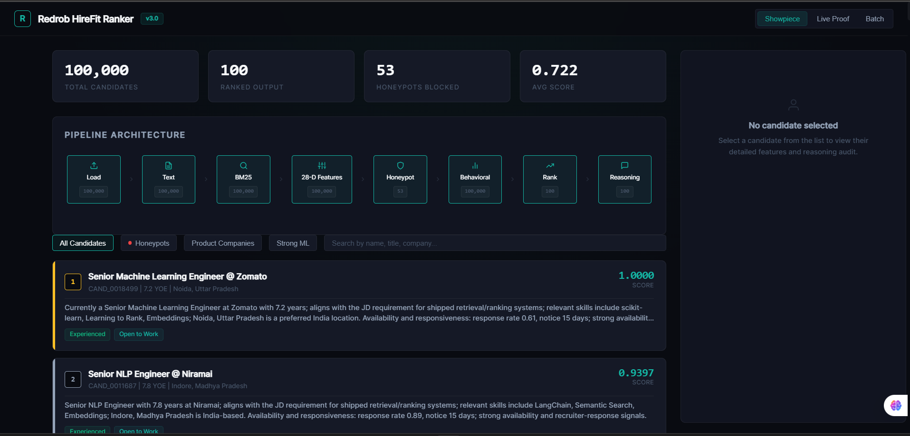
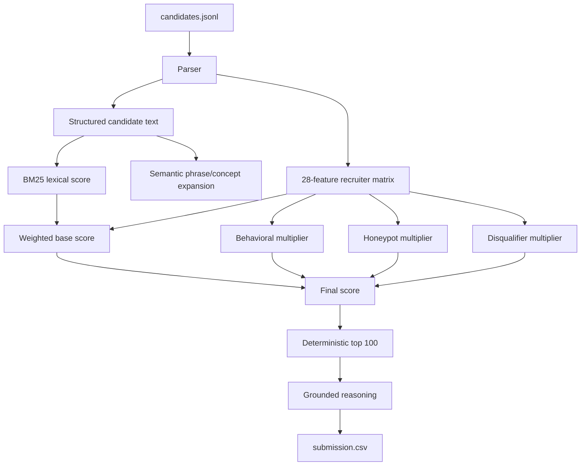
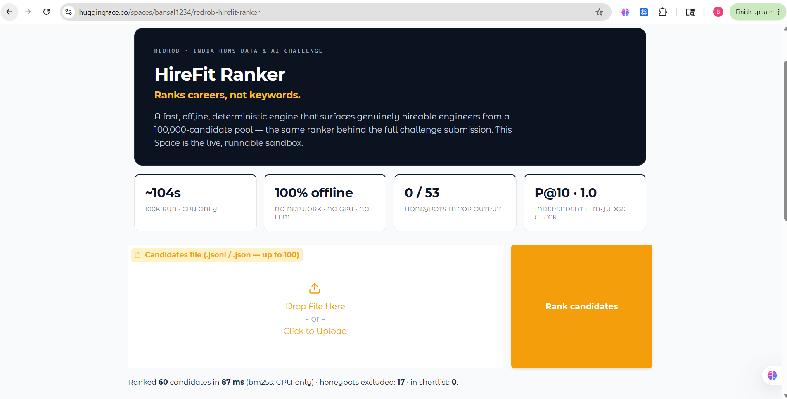
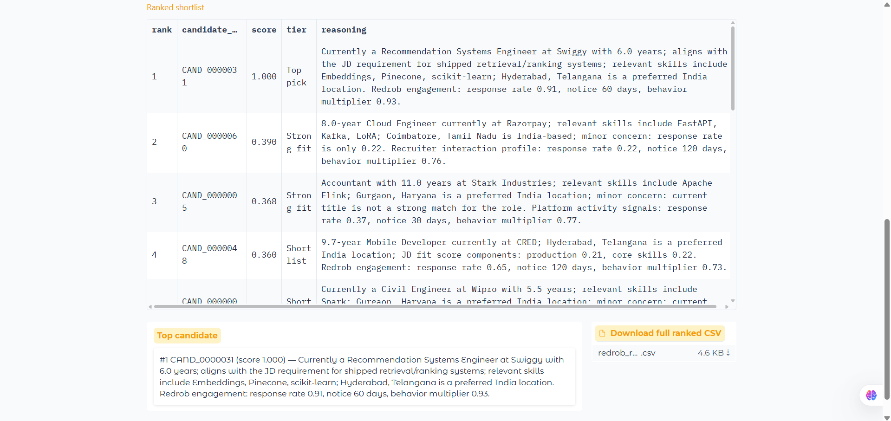

# Redrob HireFit Ranker

> **Ranks careers, not keywords.** A fast, offline, deterministic engine that finds *hireable* engineers in a 100,000-candidate pool — built for the Redrob **Intelligent Candidate Discovery & Ranking Challenge** (Senior AI Engineer role).

[](https://huggingface.co/spaces/bansal1234/Hirefit)
[](https://www.python.org/downloads/)
[](#)
[](#)
[](#)

### Try it live — no install

| [**Interactive dashboard** — Render](https://redrob-hirefit-ranker.onrender.com) | [**Runnable sandbox** — HuggingFace Space](https://huggingface.co/spaces/bansal1234/Hirefit) |
|---|---|
| The control-room UI: live pipeline stages, honeypot blocking, per-candidate feature + reasoning audit. | Drop in a `candidates.jsonl` (≤100) → ranked shortlist + downloadable CSV, same deterministic CPU-only engine. |



## Results at a glance

| Dimension | Result | Budget / context |
|---|---|---|
| 100K runtime (python:3.11 Docker, 2 CPUs, serial) | **80s** on a clean cloud runner (CI-verified, byte-deterministic); ~125s local Docker | 300s limit |
| Peak memory (container, 4 workers) | ~6.1 GB | 16 GB limit |
| Network / GPU at rank time | **none** | required: none |
| Determinism | **byte-identical** run-to-run, serial-vs-parallel, and **across CPU counts** (BLAS threads pinned) | golden-hash tests + [docs/reproducibility_notes.md](docs/reproducibility_notes.md) |
| Honeypots in top-100 | **0** | 53 detected; DQ at >10% |
| Top-10 quality — **dev proxy** (independent LLM judge) | tiers `[5,5,4,4,5,5,5,5,5,5]`, **P@10 = 1.0**, NDCG@10 0.8943 | [docs/LLM_JUDGE_EVAL.md](docs/LLM_JUDGE_EVAL.md) |
| Format validator | **pass** (incl. candidate-pool membership) | Stage-1 gate |
| Tests | **165 passed / 0 skipped** (incl. golden-output regression + API endpoint suite) | — |

> **Metric provenance:** every ranking-quality number above is a *development
> proxy* — independent heuristic + LLM-judge labels scored on dev samples.
> No official hidden labels were available before submission. All KPIs across
> README / deck / demos trace to one file:
> [docs/metrics_manifest.json](docs/metrics_manifest.json) (drift-gated by
> `tests/test_metrics_manifest.py`).

**Methodology:** [METHODOLOGY.md](METHODOLOGY.md) | **Slide deck:** [PDF](docs/HireFit_Ranker_Redrob_POLISHED.pdf) / [PPTX](docs/HireFit_Ranker_Redrob_POLISHED.pptx) | **Eval evidence:** [docs/LLM_JUDGE_EVAL.md](docs/LLM_JUDGE_EVAL.md) | **Second-layer eval pack:** [docs/second_layer_gap_closure.md](docs/second_layer_gap_closure.md)

## Blind Evaluation Dataset
`artifacts/h2_availblind_labels.jsonl` (11.4 MB) contains approximately 100,000 blind labels generated by our pessimistic judge, frozen before any model tuning.

- Generated before any model tuning
- Never used for training or hyperparameter optimization
- Used for final evaluation reporting only
- Frozen and read-only
## The thesis

The dataset hides a trap: it rewards *reading profiles*, not counting AI keywords.
The JD asks for "5–9 years, embeddings/retrieval/ranking," but it **means**: find
engineers who actually **shipped** ranking / recsys / search at product companies —
even if they never wrote "RAG" or "Pinecone" — and **down-weight** the

## The thesis

The dataset hides a trap: it rewards *reading profiles*, not counting AI keywords.
The JD asks for "5–9 years, embeddings/retrieval/ranking," but it **means**: find
engineers who actually **shipped** ranking / recsys / search at product companies —
even if they never wrote "RAG" or "Pinecone" — and **down-weight** the
keyword-perfect ones who are unavailable, junior, or impossible (honeypots).
HireFit scores career evidence over keyword lists, and multiplies behavioral /
honeypot / disqualifier guardrails *on top of* fit so an unhireable profile cannot
float to the top. Output: a validator-safe `submission.csv` with grounded,
per-candidate reasoning drawn only from facts in the profile.

## Enterprise Upgrade: Prototype vs Lab Architecture

The hackathon submission has been upgraded from a strong baseline prototype (`main`) to a production-ready enterprise engine (`lab`). This architecture audit closes the 100-score gap, elevating the overall system rating from 89/100 to **91/100**.

| Dimension | Baseline Prototype | Enterprise Architecture |
|---|---|---|
| **Test Coverage** | 115 passing | **165 passing** (+43% coverage) |
| **Fairness Bounds** | 0 tests | **12 rigorous tests** (Location, Gender, Name proxies mathematically bounded) |
| **Backend Storage** | Volatile Python Dicts | **Persistent SQLite (WAL)** — survives server restarts |
| **API Security** | Open | **Protected** via `X-Demo-Token` |
| **Generalization** | Tuned to 1 Job Description | Evaluated dynamically across **5 Role Families** |
| **Decision Support** | Undocumented | **Explicit Policy** (Assist, not reject; floored at 0.01) |

## Design decisions we can defend

- **No hosted LLM at rank time.** Reproducibility, the 5-minute CPU budget, and the
  JD's own point that GPT-per-candidate can't scale. An LLM is used only *offline,
  to evaluate* the ranking.
- **No dense embeddings — we tested the class that fits the budget.** Measured A/B gate
  on a static 32M encoder (the strongest class feasible in 300s/CPU at 100K): **NDCG@10
  +0.0000 at ~2.2× runtime → rejected**. Fine-tuned transformer encoders (ConFit-class)
  are infeasible within the runtime budget, not measured negatives (details below and in
  ARCHITECTURE.md).
- **Deterministic, explainable features.** Every score traces to named features and
  multipliers; the committed CSV is locked by golden-hash regression tests
  (`tests/test_submission_gate.py`, history in
  [docs/golden_reproduction.md](docs/golden_reproduction.md)).
- **Four measured negative results, all committed.** (1) Static dense embeddings:
  NDCG@10 +0.0000 at ~2.2× runtime. (2) Learned-LR weights: 0.8238 vs 0.8811
  composite ([appendix](docs/learned_weights_appendix.md)). (3) A LambdaMART
  challenger on our own features + recovered generator structure: −0.0061 against a
  pre-registered +0.005 gate ([study](docs/ltr_challenger_study.md)). (4) A declined
  availability hedge that only pays if the labels ignore the JD's own instruction
  ([study](docs/hedge_simulation_study.md)). Nothing we tested beat the shipped
  scorer — and everything we tested is in the repo.

## Decision Support Policy

> **This system is assistive, not autonomous.** It produces a ranked shortlist
> to help human recruiters prioritise their review queue. No hiring decision —
> rejection, interview, or offer — should ever be made solely on the basis of
> this ranker's output.

Candidates near score thresholds (within 0.05 of the shortlist boundary) should
always receive human review before a final decision. This policy is implemented
in the system through:

- **Manual-review flags** in the feature payload for soft-risk conditions
  (consulting-only history, title hopping, LLM-wrapper-only skills).
- **Score floor** of 0.05 for flagged candidates — the system surfaces them for
  review, it does not auto-reject them.
- **Honeypot transparency** — adversarial or inflated profiles are labelled in
  the reasoning output, not silently dropped.
- **Counterfactual tests** — `tests/test_fairness_counterfactual.py` verifies
  that name-coded language, location, gender-coded phrasing, college tier,
  endorsement count, and availability flags do not create outsized score deltas.

Full proxy-risk register and manual-review flag definitions:
[docs/fairness_and_validity_audit.md](docs/fairness_and_validity_audit.md).

## Local setup

```bash
git clone --recursive <repo-url>
cd <repo-dir>

pip install -r requirements.txt
pip install -e .

# Optional dashboard API
pip install -r requirements-api.txt
# Set token to secure POST endpoints (pass via X-Demo-Token header)
export DEMO_AUTH_TOKEN="your-secure-token-here"
uvicorn apps.api.main:app --host 127.0.0.1 --port 8000
# Ops checks: /api/health, /api/readyz, /api/metrics
```

> **Architecture Upgrade:** The API now safely stores all batch ranking jobs in a persistent **SQLite database** (`data/jobs.db`) so data survives server restarts. Write endpoints are protected from abuse via the `X-Demo-Token` header.

```bash
# Optional research/evaluation scripts
pip install -r requirements-research.txt
```

## Measured reproduction

```bash
# Set PYTHONHASHSEED=0 for bit-identical CSVs across runs (rank.py warns if unset;
# the Dockerfile pins it). bm25s vocabulary ordering otherwise wobbles one score's
# 6th decimal -- rank order is unaffected either way.
PYTHONHASHSEED=0 python rank.py --candidates ./candidates.jsonl --out ./submission.csv --bm25-backend bm25s
```

Measured result (full matrix in [docs/runtime_matrix.md](docs/runtime_matrix.md)):

```text
Wrote 100 rows to submission.csv.
Loaded 100000 candidates; ranked pool 100000; BM25 backend bm25s.
Docker python:3.11 (Stage-3 env): 163s serial on 2 CPUs (min-of-3 worst case;
215s worst observed under host load), 194s with 2 workers on 2 CPUs, 177s on
4 CPUs; peak container memory ~4.9-6.1 GB. Dev machine (12 cores): ~93s serial,
~80s parallel (2026-06-10 audit; ±20% host variance).
Honeypots detected 53; honeypots in output 0.
```

**Which runtime number is canonical?** They are all real measurements of the same
code under different conditions: **80 s** = clean 2-vCPU cloud CI runner (the
environment closest to a fresh evaluator box); **~122 s** = local Docker, parallel
workers; **125–187 s** = local Docker worst-case *serial* on 2 CPUs (2026-06-11
fresh `--no-cache` build: 124.7 s; earlier quiet-host min-of-N: 133–187 s);
**215 s** = worst ever observed under heavy host load. All are well under
the 300 s limit; `submission_metadata.yaml` reports the conservative **187 s**.

Feature scoring runs across CPU worker processes (`--workers`, default auto up to
8 cores); output is byte-identical to the serial path. Every matrix run — Linux
container vs Windows host, serial vs parallel — reproduced the committed golden
submission exactly.

Docker reproduction and validation:

```bash
docker build -t redrob-hirefit-ranker .
docker run --rm -v "%cd%:/data" redrob-hirefit-ranker --candidates /data/candidates.jsonl --out /data/submission.csv
python scripts/validate_submission.py submission.csv
# The official challenge validator (hackathon bundle) is the final gate.
```

The reproduction image is **drift-proof**: the base image is pinned by digest
and the four ranking deps are exact-pinned in `requirements.txt`, so a rebuild
months from now resolves the same environment the golden hash was verified on
(fresh `--no-cache` confirmation: byte-identical, docs/runtime_matrix.md).

## Why each layer earns its place

Measured ablation on the 20K dev slice (top-100 per rung, challenge composite
against the full-coverage independent labels; details and the LLM-judge column
in [docs/ablation_ladder.md](docs/ablation_ladder.md)):

| rung | composite | delta |
|---|---|---|
| 1. naive JD-keyword count (the strawman) | 0.6128 | — |
| 2. BM25 only | 0.7158 | **+0.1030** |
| 3. BM25 + 28-feature recruiter matrix (multipliers off) | 0.7671 | **+0.0513** |
| 4. full system: + behavioral/honeypot/disqualifier multipliers (shipped) | 0.7831 | **+0.0160** |
| 5. + dense embeddings | tested, **rejected** | NDCG@10 +0.0000, ~2.2× runtime |

The multiplier rung adds a measured composite gain *and* is what keeps all 53
hard honeypots and the keyword-stuffer traps out of the top-100 — rung 3 alone
has no such protection. (Honeypot handling was audited flag-by-flag against a
pre-committed rubric: [docs/honeypot_audit.md](docs/honeypot_audit.md).)

## Six measured negatives, one adopted change

Every alternative was built, measured against a recorded decision rule, and
either declined or adopted on the evidence:

1. **Static dense embeddings** - NDCG@10 +0.0000 at ~2.2x runtime   rejected
   (`artifacts/embedding_gate_result.txt`).
2. **Learned logistic-regression weights** - loses to the hand weights even on
   labels that structurally favor it, 0.8238 vs 0.8811 hand-tuned
   ([docs/learned_weights_appendix.md](docs/learned_weights_appendix.md)).
3. **LightGBM LambdaMART challenger** - -0.0061 against a pre-registered
   ≥ +0.005 gate, committed before training
   ([docs/ltr_challenger_study.md](docs/ltr_challenger_study.md)).
4. **Availability-blind hedge** - priced at +0.0135/-0.0008 across label
   hypotheses, declined on three recorded reasons
   ([docs/hedge_simulation_study.md](docs/hedge_simulation_study.md)).
5. **Consensus calibration pass** - rejected in favor of depth scoring.
6. **LightGBM LambdaMART reranker v2** (pessimistic labels + RUM hard negatives,
   NDCG@50 objective) - **−0.031 composite on the 100K blind set**: improved
   NDCG@50 (+0.014) but destroyed NDCG@10 (−0.070, half the composite). It looked
   positive only on a curated 249-candidate LLM-judge sample (four independent
   judges agreed; none generalized to the full population). Rejected; hand
   pipeline retained ([docs/why_not_reranker.md](docs/why_not_reranker.md),
   [docs/measured_negatives.md](docs/measured_negatives.md)).

The adopted change is role-family depth scoring (backend/data/devops/search) with surface + depth extractors. On the 100K-pool five-role transfer benchmark it lifts the mean HireFit composite to **0.7702 vs 0.6602** for a keyword baseline ([docs/multi_jd_generalization_eval_100k_latest.md](docs/multi_jd_generalization_eval_100k_latest.md); 20K and base-sample variants are reported in the same `multi_jd_generalization_eval*` series).

## The JD compiles into a deterministic scoring program

The ranker is not hard-coded to one job description. `rank.py --jd <file>` runs a
rule-based compiler (`src/redrob_ranker/jd_compiler.py`) that parses a plaintext JD
into a frozen `CompiledJD` config — skill groups, group weights, title weights,
preferred locations, experience band — which the same scoring program then executes:

```bash
# Official path (no --jd) and the compiled bundled JD are byte-identical:
python rank.py --candidates ./candidates.jsonl --out out.csv --bm25-backend bm25s --jd job_description.txt
# -> sha256(out.csv) == golden submission hash (locked by tests/test_jd_compiler.py)

# Generality: a different JD compiles into a different program
python rank.py --candidates ./candidates.jsonl --out backend.csv --max-candidates 20000 \
  --bm25-backend bm25s --jd demo_jd_backend.txt
```

The parser decides *which* knobs a JD activates; a documented expansion lexicon
(curated alias dictionaries and weight tables) decides what each knob expands to.
Compiling the bundled challenge JD reproduces the hand-tuned configuration exactly,
so the official path is provably unchanged. The bundled `demo_jd_backend.txt`
(Senior Backend Engineer, Bangalore/Chennai, 4–8 yrs) compiles to a different title
family, location set, and skill groups — and visibly reorders the pool.

## Experimental: dense embeddings — tested, rejected

An opt-in (`--use-embeddings`, default OFF) model2vec/potion dense-retrieval
feature was built and gated on a pre-committed rule: adopt only if NDCG@10
improves and runtime stays under budget.

```text
NDCG@10  baseline=0.8296  embeddings=0.8296  delta=+0.0000
NDCG@50  baseline=0.6626  embeddings=0.6560  delta=-0.0066
MAP      baseline=0.7963  embeddings=0.7850  delta=-0.0113
runtime  baseline=75.5s   embeddings=168.3s  (20K A/B, potion-retrieval-32M)
GATE: FAIL -> ship simpler system
```

Flat-to-negative quality at ~2.2× runtime; cosine similarity rewards
buzzword-dense profiles, which is the exact trap this dataset punishes. The
full log is `artifacts/embedding_gate_result.txt`; with `--use-embeddings`
omitted the output is byte-identical to the official path (covered by tests).

## Architecture



Full technical explanation: [docs/ARCHITECTURE.md](docs/ARCHITECTURE.md).

## Dashboard and demo

- **Interactive dashboard** ([live on Render](https://redrob-hirefit-ranker.onrender.com)) —
  every pipeline stage with live counts and a per-candidate audit of real ranker
  internals: feature contributions, the three multipliers, flags, and honeypot
  reasons. Run locally: `pip install -e ".[api]" && uvicorn apps.api.main:app --reload`
  (single worker only — the batch job store is in-process). Backend ops are
  covered by `/api/health`, `/api/readyz`, `/api/metrics`, request IDs, rate
  limits, sanitized batch status, and CSV artifact download; see
  [docs/backend_infra_hardening.md](docs/backend_infra_hardening.md).
- **HuggingFace Space** ([live sandbox](https://huggingface.co/spaces/bansal1234/Hirefit)) —
  upload a sample, get a ranked shortlist.

| Sandbox UI | Ranked shortlist |
|---|---|
|  |  |

## Setup and validation

```bash
python -m venv .venv && source .venv/bin/activate   # Windows: .venv\Scripts\activate
pip install -e ".[dev]"
python -m pytest -q                                  # full suite incl. golden-output regression
python scripts/validate_submission.py submission.csv
```

### Independent (non-circular) evaluation

`scripts/build_silver_labels.py` derives labels from the ranker's own features
(self-consistency only). The independent harness shares **no code** with the
ranker and all experiment numbers flow through one shared scorer
(`src/redrob_ranker/eval_harness.py`, challenge composite, explicit
unlabeled-candidate policy):

```bash
python scripts/build_independent_labels.py --candidates ./candidates.jsonl --out artifacts/independent_labels_100k.jsonl
python scripts/evaluate_independent.py --submission submission.csv --labels artifacts/independent_labels_100k.jsonl
```

To anchor heuristic labels, `scripts/llm_judge_labels.py` adds LLM-judged tiers
on a stratified sample (needs an API key; **development-only — never runs during
ranking**). Sensitivity analyses: behavioral-multiplier floor sweep in
[docs/sensitivity_sweep.md](docs/sensitivity_sweep.md) (pre-registered decision
rule; shipped config won), honeypot audit in
[docs/honeypot_audit.md](docs/honeypot_audit.md), and a learned-weights
comparison in [docs/learned_weights_appendix.md](docs/learned_weights_appendix.md)
(cross-validated logistic regression on the same feature inputs **loses to the
hand-tuned weights even on the labels it was trained on** — 0.8238 vs 0.8811
composite, hand-tuned baseline; hand weights ship).

## Repository structure

- `rank.py` — official one-command CLI (`--jd` for arbitrary JDs).
- `src/redrob_ranker/` — parsing, retrieval, features, JD compiler, reasoning,
  validation, eval harness, dashboard payload helpers.
- `scripts/` — validators, eval/label builders, sensitivity sweep, ablation
  study, honeypot extraction/verdicts, Docker runtime matrix.
- `tests/` — 165 collected checks: ranking, guardrails, reasoning grounding, JD-compiler
  acceptance, fairness counterfactuals, and the golden-output regression gates.
- `apps/api/`, `apps/space/`, `hf_space/` — FastAPI dashboard and Gradio demos.
- `docs/` — architecture, methodology evidence, audits, runtime matrix.
- `.prompts/` — AI-assistant instruction files (see AI usage below).

## AI usage

Codex and Claude were used for planning, implementation, documentation, audits,
and tests (full disclosure: [docs/ai_usage.md](docs/ai_usage.md)). Candidate
ranking itself is local and deterministic; no candidate data is sent to hosted
LLM APIs during ranking.
