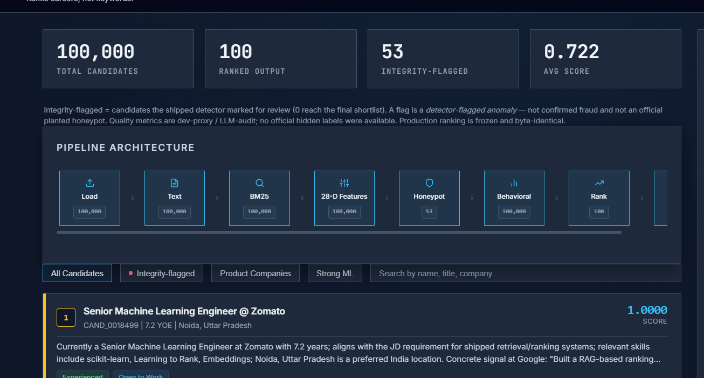
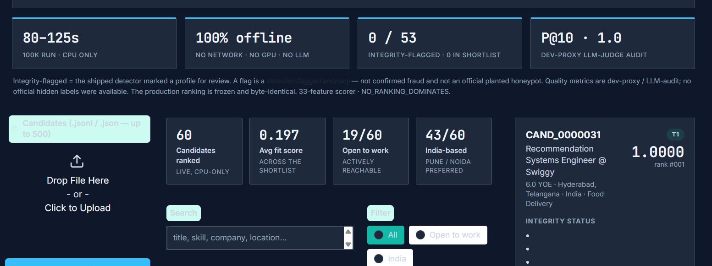
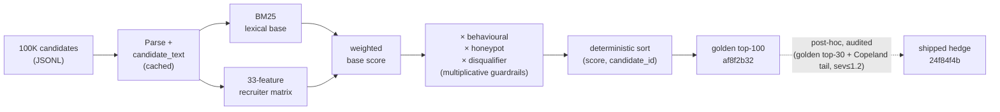
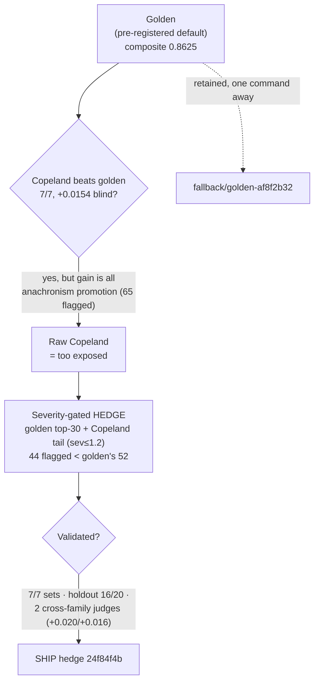

# Redrob HireFit Ranker

A deterministic, evidence-aware system that ranks the **top 100 of 100,000** candidates for a Senior
AI Engineer role — and, more importantly, a fully documented *experiment program* that shows **why**
this ranking is the one to ship.

[](#)
[](#)
[](#)
[](#)
[](#)
[](#)
[](LICENSE)
[](https://huggingface.co/spaces/bansal1234/Hirefit)

`Hedge shipped · golden fallback` · `Dashboard available` · `Human lockbox: AWAITING DATA`

---

## Contents

1. [The story in one minute](#the-story-in-one-minute)
2. [Judge quick start](#judge-quick-start)
3. [Live demos & demo video](#live-demos--demo-video)
4. [Submission snapshot](#submission-snapshot-verified-from-this-repo)
5. [The problem](#1-the-problem)
6. [The system that ships](#2-the-system-that-ships) · architecture diagram
7. [The experiment program — measured negatives](#3-the-experiment-program--what-we-tried-and-rejected)
8. [The decision — golden, then the hedge](#4-the-decision--golden-then-the-hedge)
9. [Validation — is the hedge genuinely better?](#5-validation--is-the-hedge-genuinely-better)
10. [The integrity distinction](#6-the-integrity-distinction-read-this)
11. [Reproduce & runtime](#7-reproduce--runtime)
12. [Research arc](#research-arc-uncertainty-reduction-not-metric-chasing) · [Documentation map](#documentation-map)

---

## The story in one minute

Most teams ship a model and report a score. We shipped a **measured decision**, and documented the
road to it:

1. **Golden** — a deterministic, hand-tuned 33-feature scorer with multiplicative integrity
   guardrails. Byte-reproducible, explainable, fast, CPU-only. This is the safe baseline.
2. **The experiment program** — every plausible upgrade (dense embeddings, learned weights, three
   LambdaMART rerankers, a cross-encoder, the ACL-2026 DART test-time reranker, new features) was
   built and measured against a **frozen 100K blind arbiter**. Every one **lost**. The model lever
   is empty; the bottleneck is hidden-label information, not the model.
3. **The hedge** — the one change that survived measurement. It keeps golden's **exact top-30** and
   re-orders only the tail (ranks 31–100) by Copeland rank-fusion, excluding egregious
   tenure-anachronism candidates. So NDCG@10 is *identical* to golden; the gain is a cleaner tail.
4. **Validation** — the hedge beats golden on 7/7 proxy label sets, **generalizes out-of-sample**,
   and is **confirmed by two independent LLM judges from different labs** that it was never tuned
   against. Both rate the candidates it promotes as *better hires* than the ones it drops.
5. **The hedge ships; golden is kept as a one-command fallback.** Honest limit: these are proxy
   labels, not the official hidden ones — so the claim is "weakly dominates golden with a bounded
   downside," not "guaranteed to win."

The shipped submission is the hedge (`24f84f4b`); the production ranker `rank.py` is unchanged and
still reproduces golden (`af8f2b32`) byte-for-byte.

## Judge quick start

```bash
./reproduce.sh        # production gate + shipped-hash check; runs NO research code
```
(1) runs the frozen production ranker (`rank.py`, which reproduces golden `af8f2b32` byte-for-byte),
(2) validates the output, (3) checks deterministic byte-reproduction of the shipped `submission.csv`
(the hedge, `24f84f4b`). Optional, presentation-only:

```bash
pip install -r requirements-dashboard.txt
streamlit run omega_decision_dashboard.py   # read-only explanation UI; imports no production code
```

## Live demos & demo video

| Surface | What it shows | Link |
|---|---|---|
| 🤗 **HuggingFace Space** | Upload candidates → live ranking, explainable top-100, integrity checklist | [bansal1234/Hirefit](https://huggingface.co/spaces/bansal1234/Hirefit) |
| 🖥️ **Render web app** | Pipeline visualization + filterable shortlist + per-candidate audit | [redrob-hirefit-ranker.onrender.com](https://redrob-hirefit-ranker.onrender.com) |
| 📊 **Decision dashboard** | `NO_RANKING_DOMINATES` verdict, shipping gates, golden-vs-hedge studies | `streamlit run omega_decision_dashboard.py` |

**🎬 Demo video:** _2-minute walkthrough — link to be added here._

<!-- Screenshots are interim (captured before the 2026-06-16 contrast pass); refresh after the
     next Render/HF redeploy. Stored in docs/assets/. -->

**Render — pipeline & shortlist**



**HuggingFace Space — upload & live ranking**



## Submission snapshot (verified from this repo)

| Property | Verified value |
|---|---|
| Shipped submission | **Severity-gated Copeland hedge** (`24f84f4b`) — golden `af8f2b32` retained as the `fallback/golden-af8f2b32` tag |
| Production pipeline | Deterministic `rank.py`, **33-feature** scorer — reproduces golden `af8f2b32` byte-for-byte |
| Dataset | 100,000 candidates → top-100 submission |
| Tests | 198 passed, 0 skipped |
| Hedge vs golden (blind arbiter) | composite **0.8748 vs 0.8625**, **beats golden on 7/7** label sets — *dev proxy / LLM-audit; **No official hidden labels*** |
| Independent cross-family confirmation | gpt-4.1 **+0.0197** · gemini-2.5-pro **+0.0160** (never selected against) |
| Dev-proxy quality | NDCG@10 0.8943 · P@10 = 1.0 — *dev proxy / LLM-audit* |
| Runtime | ~80s cloud 2-vCPU · 165s Docker `--cpus=2 --memory=16g` (matrix 124.7–193.4s; budget 300s) |
| Memory | peak ~6.1 GB vs 16 GB budget |
| Execution | CPU-only, offline, deterministic (`PYTHONHASHSEED=0`) |
| Determinism | shipped sha256 `24f84f4b6160a4bc…`; production reproduces golden `af8f2b327f05d30e…` |
| Shipped-detector flags in top-100 | 0 (of 53 honeypots detected) |
| Experimental anachronism anomalies | **44** (golden carries 52) |
| Final automated verdict | `NO_RANKING_DOMINATES` |

> The quality rows are **dev proxies** (LLM-audit), explicitly **not** the official hidden
> competition score. We never claim to know the hidden labels.

---

## 1. The problem

The JD wants a Senior AI Engineer who has *shipped* production retrieval/ranking/recsys systems at a
product company, 5–9 years, with strong availability signals. The trap in the data: keyword-stuffed
profiles that *list* the buzzwords score high on naive matching, while the engineers who actually
built the systems (and describe the work, not the keywords) score lower. Planted honeypots and
impossible profiles (e.g. tenure in a technology longer than it has existed) sit in the contested
zone. A good ranker must read evidence, not keywords, and must not be fooled by traps.

## 2. The system that ships

`rank.py` reads structured candidate evidence (skills with durations, dated career history,
education, behavioural signals) and:

- computes a **BM25** lexical base score, then a **33-feature** deterministic recruiter matrix
  (skills, career evidence, seniority band, Python/eval depth, role-family depth, location,
  availability) that separates keyword lists from recruiter-plausible fit;
- applies **multiplicative** behavioural / honeypot / disqualifier guardrails — a perfect-on-paper
  profile with no activity or an impossible claim is multiplied down, not softly penalised;
- emits an explainable, **byte-reproducible** top-100 with grounded per-candidate reasoning.



CPU-only, fully offline, no network, no model downloads at inference. Determinism is enforced
(`PYTHONHASHSEED=0`, pinned BLAS threads) and locked by a regression test that re-runs the ranker on
a 2k slice and matches a recorded hash. Per-stage timing: `docs/performance_audit.md`.

## 3. The experiment program — what we tried and rejected

The strongest signal in this submission is everything we **did not** ship. Each alternative was
built, measured against the **frozen 100K blind arbiter** (`artifacts/h2_availblind_labels.jsonl`,
frozen before any tuning), and rejected on the evidence — not on taste. A measured negative is a
strength: it proves the lever is empty.

| Alternative | Measured result on the blind arbiter | Verdict |
|---|---|---|
| Static dense embeddings (potion-32M) | NDCG@10 **+0.0000** at ~2.2× runtime | Rejected |
| Learned logistic-regression weights | composite **0.8238 vs 0.8811** | Rejected |
| LightGBM LambdaMART v2 (NDCG@50 obj.) | composite **−0.031**, NDCG@10 **−0.070** | Rejected |
| LambdaMART v3 *trained on the blind labels themselves* (leak-safe holdout) | holdout NDCG@10 **−0.040 to −0.104** | Rejected |
| **DART** test-time reranker (ACL 2026) | **replicated the paper (+5.3% rel, above its own +2.1%)** yet composite **0.649 vs 0.808** (−23% rel) | Rejected |
| Top-K cross-encoder (ms-marco-MiniLM) | in-sample +0.014 → **−0.016 on the untouched holdout** | Rejected |
| Learned interaction features (title×evidence) | single split +0.008 → **noise under 20× repeated holdout** | Rejected |
| New orthogonal features (impact-density, gzip-NCD) | **no train-supported lift** (best train Δ = 0.0000) | Rejected |
| Rank-space Fusion — **clean** (no anachronism promotion) | **−0.0322** holdout (1/20) | Rejected |
| Rank-space Fusion — **raw / Copeland** | +0.013 blind, 7/7 — but gain from promoting anachronism candidates | Refined into the hedge (§4) |

**The pattern (`docs/measured_negatives.md`):** five rerankers, five learned/feature alternatives,
and a rank-space fusion family — **all failed against independent labels.** The sharpest case (DART)
was replicated *above* its published gain and still lost by 23% relative, because it adapts a dense
representation carrying less task signal than the 33 hand-tuned features. **Conclusion: the
model/trick lever is empty; the bottleneck is feature information content + hidden-label
availability, not the model.**

## 4. The decision — golden, then the hedge



One rank-space family did beat golden on the proxies: **Copeland** (Condorcet pairwise-win
aggregation over 6 base rankers, +0.0154 blind). But raw Copeland's gain came from promoting
**anachronism-flagged** candidates — a bet that wins only if the hidden judges don't date-check
tenure. The **hedge** is the disciplined version of that bet:

> **The shipped submission = golden's exact top-30, then ranks 31–100 re-drawn from the pool by
> Copeland score, excluding anachronism candidates with severity > 1.2** (claimed tenure ≤1.2× the
> technology's age = plausible rounding; egregious cases excluded).

Verified consequences (`experiments/exp_two_studies.py`):

- Hedge and golden are **byte-identical in order through rank 30** (first divergence: rank 31) ⇒
  **NDCG@10 and P@10 are unchanged from golden by construction**. Every measured gain is a
  better-ordered *tail*.
- The hedge carries **fewer anachronism candidates than golden** (44 vs 52) — so it is *less*
  exposed to an anachronism-penalty world than the fallback, while raw Copeland carried 65.
- Production `rank.py` is **unchanged**; the hedge is a deterministic, audited post-hoc rerank
  (`experiments/build_hedge_submission.py`).

## 5. Validation — is the hedge genuinely better?

We do not just assert the upgrade; we validate it under one frozen protocol, and we draw the
honest line between *retrospective* and *out-of-sample* evidence. Full record:
[`docs/golden_vs_hedge_two_studies.md`](docs/golden_vs_hedge_two_studies.md).

| Study | Evidence | Result |
|---|---|---|
| 1 + 2 | golden vs hedge on the arbiter + 6 judge sets (retrospective) | hedge **7/7**, gain entirely NDCG@50/MAP (NDCG@10 identical) |
| 3 | out-of-sample holdout (threshold chosen on a train half, scored on the untouched test half; R=20) | **generalizes**: mean **+0.012**, 16/20 splits positive |
| 3b | independent judge **gpt-4.1** (never used to select the hedge) | composite **+0.0197** |
| 3b | independent judge **gemini-2.5-pro** (different lab, integrity-strict) | composite **+0.0160** |
| diff | do the swaps upgrade or game the metric? | promoted rated **above** dropped by *both* judges (4.11 vs 3.58; 3.28 vs 2.69) |
| diff | is it just the anachronism bet? | **no — 23 of 36 promotions are clean**, also rated above the dropped set |
| diff | does it add integrity exposure? | **no** — the strict judge flags **32 = 32** integrity issues in golden and hedge alike |

**Reading it honestly.** Two independent judges from different labs — one lenient, one so strict it
tier-0s a third of all candidates — *both* confirm the hedge and *both* agree its tail swaps are
real upgrades, with no extra integrity exposure over golden. The downside is bounded: golden and
hedge tie on the top-heavy part of the metric, and the hedge is *less* anachronism-exposed than the
fallback. What none of this proves is the official hidden score — so the claim is **"the hedge weakly
dominates golden,"** not "guaranteed to win." If the Ψ human panel later shows the promoted tail is
integrity-compromised, golden reverts in one command (`fallback/golden-af8f2b32`).

## 6. The integrity distinction (read this)

> **Detector-flagged anomaly ≠ confirmed hard contradiction ≠ official planted honeypot.**

- The **shipped honeypot detector** flags **0** candidates in the shipped hedge's top-100 (verified
  on `submission.csv`).
- A **separate experimental anachronism detector** flags **44** technology-tenure anomalies — fewer
  than golden's 52, because the hedge promotes only defensible cases and excludes egregious ones.
- Those 44 are **not** confirmed fraud, **not** hard contradictions, and **not** known official
  honeypots (the official IDs are unavailable to us).
- A **downstream, non-ranking** integrity layer assigns proportionate states: the 44 anomalies map
  to `PROBABLE_CONTRADICTION → VERIFY`; the remaining 56 are `CLEAR/AMBIGUOUS → CONTINUE/CLARIFY`;
  **0** are `CONFIRMED_CONTRADICTION → BLOCK`. `VERIFY` requests human review; it never asserts fraud
  and never reorders candidates.

## 7. Reproduce & runtime

```bash
./reproduce.sh                                    # production gate + shipped-hash check
sha256sum submission.csv                          # -> 24f84f4b6160a4bc… (shipped hedge)
# production rank.py still reproduces golden af8f2b327f05d30e… (verified by the slice gate)
```

Measured full 100K run, byte-identical to golden every time: **~80s** on a clean 2-vCPU cloud
runner; best local Docker serial **~125s** (124.7s); **165s** under `docker --cpus=2 --memory=16g`;
worst recorded 193.4s — all inside the 300s budget. Peak memory ~6.1 GB of 16 GB. CPU-only, offline, deterministic. Full path:
`docs/REPRODUCTION.md`; runtime matrix: `docs/runtime_matrix.md`.

## Research arc (uncertainty reduction, not metric chasing)

```text
Golden → Competitor audit → Learned-model & Cross-Encoder experiments → Rank-space Fusion
  → Judge-dependence & influence audits → Evidence-channel experiments
  → Integrity-constrained Fusion → Ω decision framework
  → Ψ candidate-specific human instrument → Φ public hiring-norms study
  → Rank-space Condorcet (Copeland) → severity-gated hedge
  → two-study + cross-family validation → Ship Hedge (golden retained as fallback)
```

## Documentation map

- **The decision & its validation:** [docs/SHIPPING_DECISION.md](docs/SHIPPING_DECISION.md) ·
  [docs/golden_vs_hedge_two_studies.md](docs/golden_vs_hedge_two_studies.md) ·
  [docs/best_of_best_meta_study.md](docs/best_of_best_meta_study.md)
- **Reproduce & runtime:** [docs/REPRODUCTION.md](docs/REPRODUCTION.md) ·
  [docs/runtime_matrix.md](docs/runtime_matrix.md)
- **What we rejected:** [docs/measured_negatives.md](docs/measured_negatives.md) ·
  [docs/why_not_reranker.md](docs/why_not_reranker.md)
- **Integrity & human evidence:** [docs/PSI_INTEGRITY_PANEL.md](docs/PSI_INTEGRITY_PANEL.md) ·
  [docs/OMEGA_DECISION_SUMMARY.md](docs/OMEGA_DECISION_SUMMARY.md) ·
  [docs/human_opinion/HUMAN_OPINION_LANDSCAPE.md](docs/human_opinion/HUMAN_OPINION_LANDSCAPE.md)
- **Program index:** [docs/research/RESEARCH_PROGRAM_INDEX.md](docs/research/RESEARCH_PROGRAM_INDEX.md) ·
  [docs/research/FINAL_RESULT_CATALOG.md](docs/research/FINAL_RESULT_CATALOG.md)

## Research boundary

> Experimental systems are included for transparency, auditability and reproducibility. They do not
> alter the production ranker. The remaining unresolved evidence requires real humans: the Ψ
> candidate panel, an independent Φ coder, and verified recruiter/India-practitioner perspectives.
> No missing human evidence was simulated or fabricated.

## License

Released under the **MIT License** — see [`LICENSE`](LICENSE). © 2026 Bhunesh Bansal. The bundled
competition dataset is **not** redistributed and remains the property of Redrob.
