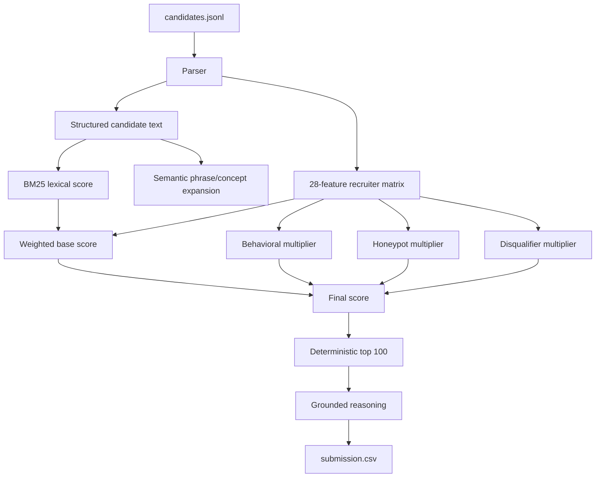

# Redrob HireFit Ranker

A deterministic, CPU-only candidate ranking engine for the Redrob India Runs Data & AI Challenge.

[](https://www.python.org/downloads/)
[](#)
[](#)

Live sandbox: [redrob-hirefit-ranker on HuggingFace Spaces](https://huggingface.co/spaces/bansal1234/redrob-hirefit-ranker)

## What It Does

The official ranker reads `candidates.jsonl`, scores all 100,000 profiles against the Senior AI Engineer JD, and writes a validator-safe `submission.csv` with:

```text
candidate_id,rank,score,reasoning
```

The design is intentionally offline and deterministic:

- No OpenAI, Claude, Gemini, or hosted API scoring during ranking.
- No model downloads or dense embedding dependency in the official path.
- `bm25s` lexical retrieval with `rank-bm25` fallback.
- A 28-feature recruiter matrix for skills, career, experience, behavior, and logistics.
- Multiplicative behavioral, honeypot, and disqualifier guardrails.
- Grounded reasoning generated only from candidate facts and feature triggers.

## Measured Reproduction

Command used for the final local 100K run:

```bash
python rank.py --candidates ./candidates.jsonl --out ./submission.csv --bm25-backend bm25s
```

Measured result on the local challenge file:

```text
Wrote 100 rows to submission.csv.
Loaded 100000 candidates; ranked pool 100000; BM25 backend bm25s.
Runtime 264.8s.
Peak RSS 4.07 GB in a profiled full run.
Hard honeypots detected 53; hard honeypots in output 0.
```

Both validators passed:

```bash
python scripts/validate_submission.py submission.csv
python validate_submission.py submission.csv
```

Development silver-label check on the first 20K candidates:

```text
NDCG@10 0.9088
NDCG@50 0.8482
P@10    1.0000
MAP     0.7518
```

These are heuristic JD-rule silver labels for tuning and defense, not the hidden challenge score.

## Architecture



Read the full technical explanation in [docs/ARCHITECTURE.md](docs/ARCHITECTURE.md).

## Dashboard And Demo

The repo includes a FastAPI dashboard for interview/demo use. It exposes real ranker internals, including:

- top feature contributions
- behavioral, honeypot, and disqualifier multipliers
- feature-derived flags and honeypot reasons
- profile, skills, education, timeline, and behavioral signals

Generate the showpiece payload from a validated full run:

```bash
python scripts/generate_precomputed.py \
  --candidates ./candidates.jsonl \
  --submission submission.csv \
  --out apps/api/data/precomputed.json \
  --total-candidates 100000 \
  --processing-time-ms 264800 \
  --bm25-backend bm25s \
  --honeypots-blocked 53 \
  --honeypots-in-output 0
```

Run the API locally:

```bash
pip install -e ".[demo]"
uvicorn apps.api.main:app --reload
```

Then open [http://localhost:8000](http://localhost:8000).

Public demo safety defaults:

- `/api/rank` processes at most 500 uploaded candidates and rejects uploads over 2 MB.
- `/api/batch` processes at most 5,000 uploaded candidates and rejects uploads over 16 MB.
- In-memory batch jobs are capped at 20 stored jobs.
- Set `REDROB_CORS_ORIGINS`, `REDROB_MAX_LIVE_CANDIDATES`, `REDROB_MAX_BATCH_CANDIDATES`,
  `REDROB_MAX_LIVE_UPLOAD_BYTES`, `REDROB_MAX_BATCH_UPLOAD_BYTES`, or `REDROB_MAX_STORED_JOBS`
  to override these demo limits on a host like Render.

Run the Gradio Space locally:

```bash
pip install -r requirements-demo.txt
python apps/space/app.py
```

## 90-Second Demo Script

1. Open with the thesis: "HireFit ranks careers, not keywords. The official run is CPU-only, deterministic, and validator-safe."
2. Upload a small JSON/JSONL sample in the HuggingFace Space and export the ranked CSV.
3. Show the top candidate reasoning and point to concrete facts: title, years, skills, production/retrieval evidence, location, notice, and response behavior.
4. Open the dashboard/API payload and show feature contributions plus hard-vs-soft guardrails.
5. Close with the measured full run: 100K candidates, no network, no GPU, hard honeypots excluded from the top 100.

## Setup

```bash
python -m venv .venv
.venv\Scripts\activate
pip install -e ".[dev]"
```

Linux/macOS activation:

```bash
source .venv/bin/activate
```

## Validation

```bash
python -m compileall -q src tests rank.py apps scripts
python -m pytest -q
python scripts/validate_submission.py submission.csv
```

The official challenge validator should still be used as the final gate when available.

Silver-label development evaluation:

```bash
python scripts/build_silver_labels.py --candidates ./candidates.jsonl --out artifacts/silver_labels_20k.jsonl --max-candidates 20000
python rank.py --candidates ./candidates.jsonl --out submission_20k.csv --max-candidates 20000
python scripts/evaluate_silver.py --submission submission_20k.csv --labels artifacts/silver_labels_20k.jsonl
```

Docker reproduction:

```bash
docker build -t redrob-hirefit-ranker .
docker run --rm -v "%cd%:/data" redrob-hirefit-ranker --candidates /data/candidates.jsonl --out /data/submission.csv
```

Runtime and peak-RSS profiling:

```bash
python scripts/measure_runtime_memory.py --candidates ./candidates.jsonl --out ./submission.csv --result-json artifacts/runtime_memory_full.json
```

## Repository Structure

- `rank.py`: official one-command CLI.
- `src/redrob_ranker/`: parsing, retrieval, feature scoring, reasoning, validation, and dashboard payload helpers.
- `apps/api/`: FastAPI dashboard backend and tracked precomputed showpiece payload.
- `apps/space/`: local Gradio demo app.
- `hf_space/`: deployed HuggingFace Space wrapper.
- `scripts/`: validation, precomputed payload generation, and silver-label evaluation.
- `docs/`: architecture and implementation notes.
- `tests/`: unit and integration-style checks for ranking, guardrails, payloads, and reasoning.

## AI Usage

Codex was used for planning, implementation, documentation, and tests. Claude/Kimi audit notes were used as offline design-review references. Candidate ranking itself is local and deterministic; no candidate data is sent to hosted LLM APIs during ranking.
