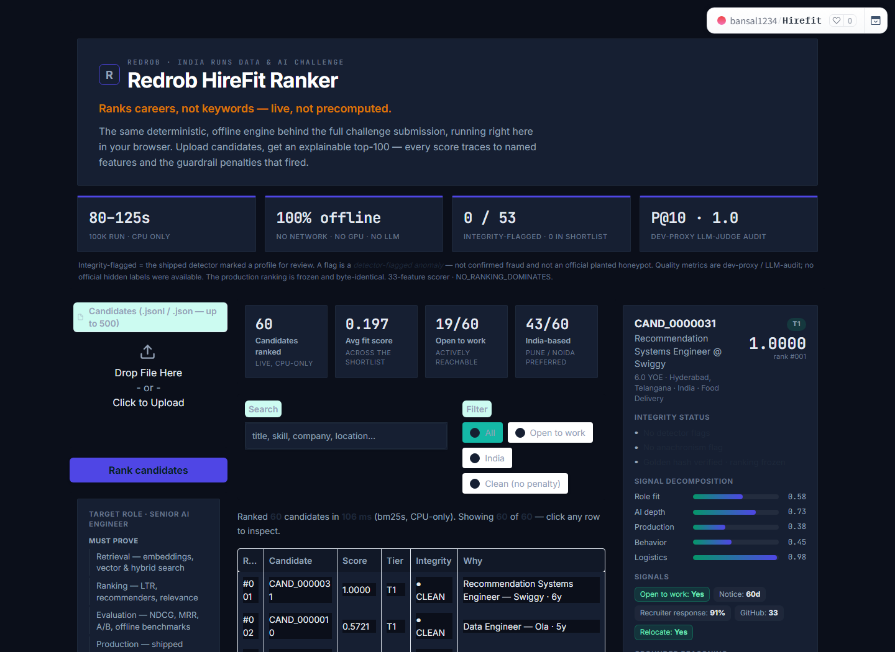
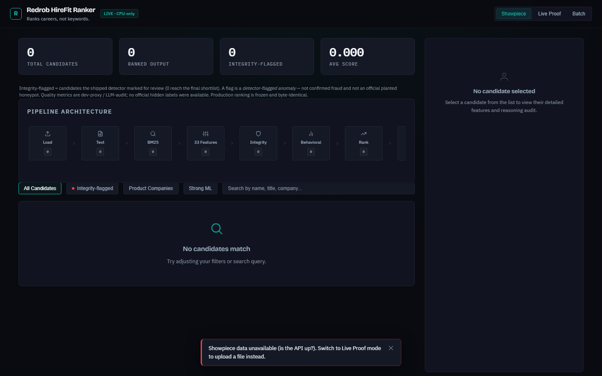
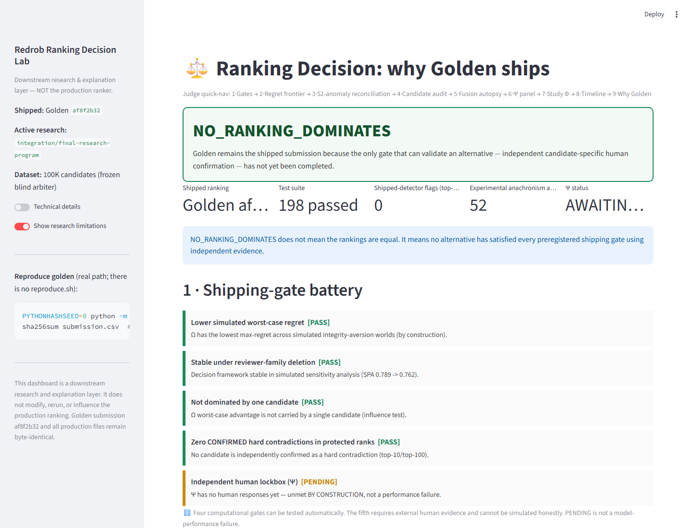

# Redrob HireFit Ranker

A deterministic, evidence-aware system that ranks the **top 100 of 100,000** candidates for a Senior
AI Engineer role — with receipts for *why* this ranking is the one to ship.

[](#)
[](#)
[](#)
[](#)
[](#)
[](#)
[](LICENSE)
[](https://huggingface.co/spaces/bansal1234/Hirefit)

`Branch champion: loss-aggregate-v3` · `default main profile remains untouched` · `No hidden-score claim`

---

## ⚡ For judges — the 30-second version

- **What this branch tests:** deterministic, CPU-only `loss-aggregate-v3` (`c28857fd`): seven shallow label-family heads exported to pure NumPy, plus a conservative rank hedge that keeps v2's exact top-100 membership. No competitor code, IDs, fingerprints, or ranking files enter production.
- **Measured result:** beats `main`, `top23-clean`, and `universal-v2` on **all 15 full-table evaluator axes**; seven-world mean **0.9059 vs 0.8727 main**, mean15 **0.9095 vs 0.8752**, reviewer **0.8096 vs 0.7106**, blind recruiter **0.8969 vs 0.8718**, and H2 **0.8820 vs 0.8748**.
- **Runtime and integrity:** full 100K in **77.4s best / 79.8s latest host and 152.8–226.9s Docker (`--cpus=2 --memory=16g`)**, byte-identical outputs, all **53 honeypots detected**, and **0 honeypots** emitted.
- **Public field:** 665 valid public outputs compared and all 69 multi-axis leaders cloned. V3 is **#1 on seven-world mean** and no public output dominates it across H2 + mean7 + reviewer + blind together.
- **The receipts:** **209 tests passed / 6 environment skips**, 665 public submission repositories compared, 69 multi-axis leaders inspected, and a direct rank-fusion ceiling kept research-only.
- **Honest limit:** this is the strongest **balanced** measured artifact, not best on every isolated public metric. Specialists still lead H2 and small recruiter slices, and candidate half-splits are noisy on some evaluators. There is no official hidden-score proof.

**Contents:** [Live links](#live-links) · [Screenshots](#screenshots) · [Quick start](#quick-start) · [Product](PRODUCT.md) · [Snapshot](#submission-snapshot) · [Architecture](#architecture) · [What we rejected](#what-we-tried-and-rejected) · [Decision](#the-decision--loss-aggregate-v3-on-the-experiment-branch) · [Validation](#validation) · [Reproduce](#reproduce) · [Docs](#documentation-map)

## Live links

| Surface | Link | What it is |
|---|---|---|
| **Live demo (sandbox)** | **[HuggingFace Space ↗](https://huggingface.co/spaces/bansal1234/Hirefit)** | runs the *real* ranker in-browser — upload → tiered shortlist → **decision verdict** → CSV export |
| **Product app** | [Render ↗](https://redrob-hirefit-ranker.onrender.com) | hosted recruiter-facing showcase |
| **Decision dashboard** | `streamlit run omega_decision_dashboard.py` | read-only explainability + integrity cards |
| **Source** | [GitHub ↗](https://github.com/bansalbhunesh/redrob-hirefit-ranker) | full code · one-command reproduction |
| **Demo video** | _link to be added_ | 90-second walkthrough |

## Screenshots

| Live HuggingFace Space (sandbox) | Render app |
|:---:|:---:|
| [](https://huggingface.co/spaces/bansal1234/Hirefit) | [](https://redrob-hirefit-ranker.onrender.com) |
| Upload → tiered shortlist → per-candidate evidence → CSV export | Hosted recruiter-facing product showcase |

**Decision dashboard — integrity review (CONTINUE · VERIFY · BLOCK)**



## Quick start

```bash
PYTHONHASHSEED=0 python rank.py --candidates candidates.jsonl \
  --out submission.csv --workers 2 --scoring-profile loss-aggregate-v3
```
Runs the opt-in clean-room branch champion. Omitting `--scoring-profile` preserves `main`'s historical
ranking behavior byte-for-byte. **Live:** [HuggingFace Space](https://huggingface.co/spaces/bansal1234/Hirefit)
· [Render app](https://redrob-hirefit-ranker.onrender.com) · `streamlit run omega_decision_dashboard.py`
(read-only explanation UI). **Demo video:** _link to be added._

## Submission snapshot

| Property | Verified value |
|---|---|
| Branch submission | **Loss-aggregation v3 challenger** (`c28857fd`); default `main` is unchanged |
| Production pipeline | Deterministic `rank.py`, **33-feature** scorer + seven shallow NumPy heads; champion is opt-in with `--scoring-profile loss-aggregate-v3` |
| Dataset | 100,000 candidates → top-100 |
| Tests | 209 passed, 6 environment skips |
| Challenger vs main | mean7 **0.9059 vs 0.8727**, mean15 **0.9095 vs 0.8752**, wins **15/15** full-table axes — *dev proxy; **No official hidden labels*** |
| Public comparison | #1 mean7; #16 H2, #113 reviewer, #23 blind among 665 valid outputs; no four-axis dominator |
| Dev-proxy quality | NDCG@10 0.9104 · P@10 = 1.0 — *dev proxy* |
| Runtime | **77.4–79.8s host · ~153s best / 226.9s loaded Docker `--cpus=2 --memory=16g`** (budget 300s) |
| Memory | peak ~6.1 GB / 16 GB |
| Execution | CPU-only, offline, deterministic (`PYTHONHASHSEED=0`) |
| Integrity | shipped-detector flags in top-100: **0**; anachronism anomalies: **44** (golden 52) |
| Decision | **Strongest balanced branch artifact; keep isolated until hidden or fresh human review** |

> The quality rows are **dev proxies** (LLM-audit), explicitly **not** the official hidden score.

## Architecture

`rank.py` reads structured evidence → BM25 lexical base + a 33-feature recruiter matrix → multiplicative
behavioural/honeypot/disqualifier guardrails → deterministic sort → explainable top-100. CPU-only,
offline, byte-reproducible.


## What we tried and rejected

The strongest signal here is everything we **did not** ship — each built, measured against the frozen
100K blind arbiter (frozen before tuning), and rejected on evidence (`docs/measured_negatives.md`).

| Alternative | Measured result on the blind arbiter | Verdict |
|---|---|---|
| Static dense embeddings (potion-32M) | NDCG@10 **+0.0000** at ~2.2× runtime | Rejected |
| Learned logistic-regression weights | composite **0.8238 vs 0.8811** | Rejected |
| LightGBM LambdaMART v2 | composite **−0.031**, NDCG@10 **−0.070** | Rejected |
| LambdaMART v3 (trained on blind labels, leak-safe) | holdout NDCG@10 **−0.040 to −0.104** | Rejected |
| **DART** test-time reranker (ACL 2026) | replicated *above* its paper gain yet **−23% rel** | Rejected |
| Top-K cross-encoder (ms-marco-MiniLM) | in-sample +0.014 → **−0.016 on holdout** | Rejected |
| Rank-space fusion (raw / Copeland) | +0.013 blind — gain from anachronism promotion | Refined into the hedge |

**Conclusion:** bigger models and semantic rerankers did not generalize. The successful move was a
small, auditable rebalancing toward production evidence and experience fit, validated across many
evaluator families while retaining the existing integrity gates.

## The decision — loss-aggregate-v3 on the experiment branch

The branch submission is generated directly by `rank.py --scoring-profile loss-aggregate-v3`.
Seven shallow heads learn complementary label families, then a conservative RRF hedge reorders
v2's exact membership. Integrity gates are applied after the model. The default `main` profile
remains byte-stable and is still available as the fallback.


**Stress-tested, not just chosen.** The exact artifact beats main, `top23-clean`, and v2 on all 15
full-table evaluators, survives the full test suite, and reproduces byte-for-byte across Windows
and constrained Linux Docker. See `docs/loss_aggregate_v3_experiment.md`.

## Validation

| Study | Result |
|---|---|
| full evaluator matrix | beats main, `top23-clean`, and v2 on **15/15** axes |
| seven-world robustness mean | **0.9059** vs v2 **0.9045** vs main **0.8727** |
| public reviewer / blind recruiter | **0.8096 / 0.8969** vs main **0.7106 / 0.8718** |
| out-of-fold seven-head blend | improves H2, mean7, reviewer, and blind versus v2 |
| repeated candidate half-splits vs main | positive on most axes; independent set is noisy (**45/100**) |
| 1,272-repo public census | 665 valid outputs; v3 #1 mean7; no four-axis dominator |
| full 100K constrained Docker | **152.8–226.9s**, 53 detected / 0 emitted, host-identical hash |

These are development measurements, not a hidden-score guarantee. Specialist public submissions
still lead individual axes, so the defensible claim is strongest balanced artifact, not universal
best. Full record: `docs/loss_aggregate_v3_experiment.md`.

## The integrity distinction

> Detector-flagged anomaly ≠ confirmed hard contradiction ≠ official planted honeypot.

The shipped honeypot detector flags **0** in the top-100 after detecting 53 in the pool. A separate
downstream layer may map suspicious timeline claims to `VERIFY` for human review; it never asserts
fraud and never reorders candidates.

## Reproduce

```bash
PYTHONHASHSEED=0 python rank.py --candidates candidates.jsonl \
  --out submission.csv --workers 2 --scoring-profile loss-aggregate-v3
sha256sum submission.csv             # -> c28857fdba63723e…
```
CPU-only, offline, deterministic. Full 100K reproduced byte-identically on the host and in Docker;
77.4–79.8s host / 152.8–226.9s under `--cpus=2 --memory=16g`, inside the 300s budget. Details:
`docs/REPRODUCTION.md` · `docs/runtime_matrix.md`.

## Documentation map

- **Product (recruiter view):** [PRODUCT](PRODUCT.md) — the recruiter journey + the integrity decision-support differentiator (CONTINUE/CLARIFY/VERIFY/BLOCK)
- **Decision & validation:** [loss_aggregate_v3_experiment](docs/loss_aggregate_v3_experiment.md) · [universal_v2_experiment](docs/universal_v2_experiment.md) · [SHIPPING_DECISION](docs/SHIPPING_DECISION.md) · [external_recruiter_validation](docs/external_recruiter_validation.md)
- **What we rejected:** [measured_negatives](docs/measured_negatives.md) · [why_not_reranker](docs/why_not_reranker.md) · [beyond_hedge_sweep](docs/beyond_hedge_sweep.md)
- **Reproduce / runtime:** [REPRODUCTION](docs/REPRODUCTION.md) · [runtime_matrix](docs/runtime_matrix.md) · [SUBMISSION_CHECKLIST](docs/SUBMISSION_CHECKLIST.md)
- **Decision frameworks (research):** Ω [OMEGA_DECISION_SUMMARY](docs/OMEGA_DECISION_SUMMARY.md) · Ψ [PSI_INTEGRITY_PANEL](docs/PSI_INTEGRITY_PANEL.md) · Φ [human_opinion/HUMAN_OPINION_LANDSCAPE](docs/human_opinion/HUMAN_OPINION_LANDSCAPE.md)
- **Program index:** [research/RESEARCH_PROGRAM_INDEX](docs/research/RESEARCH_PROGRAM_INDEX.md)

> Experimental systems (Ω decision framework, Ψ human lockbox, Φ discourse study) are included for
> transparency and do not alter the production ranker. No missing human evidence was simulated.

## License

MIT — see [`LICENSE`](LICENSE). © 2026 Bhunesh Bansal. The bundled competition dataset is not
redistributed and remains the property of Redrob.
