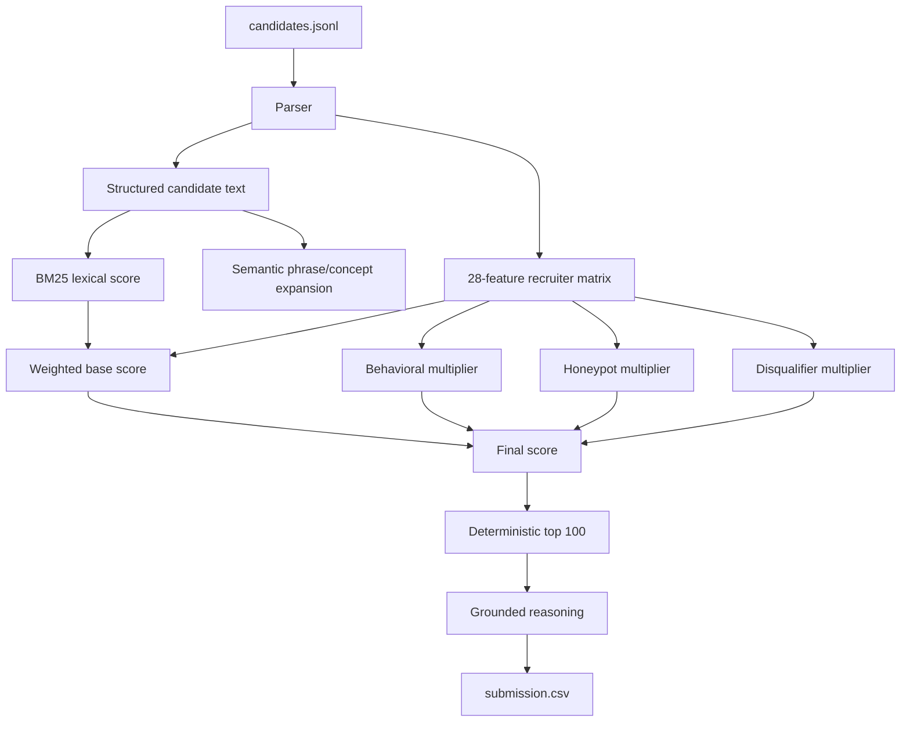
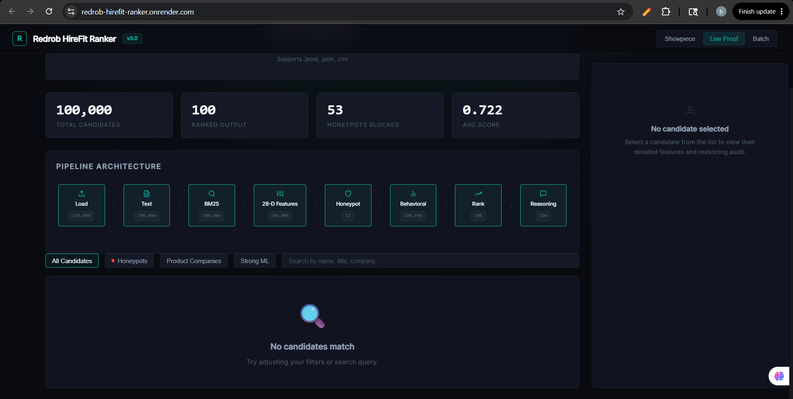

# Redrob HireFit Ranker

> **Ranks careers, not keywords.** A fast, offline, deterministic engine that finds *hireable* engineers in a 100,000-candidate pool — built for the Redrob **Intelligent Candidate Discovery & Ranking Challenge** (Senior AI Engineer role).

[](https://huggingface.co/spaces/bansal1234/redrob-hirefit-ranker)
[](https://www.python.org/downloads/)
[](#)
[](#)
[](#)
[](#)

### ▶ Try it live — no install

| 🖥️ [**Interactive dashboard** — Render](https://redrob-hirefit-ranker.onrender.com) | 🧪 [**Runnable sandbox** — HuggingFace Space](https://huggingface.co/spaces/bansal1234/redrob-hirefit-ranker) |
|---|---|
| The full control-room UI: live pipeline stages, honeypot blocking, and a per-candidate feature + reasoning audit. | Drop in a `candidates.jsonl` (≤100) → ranked shortlist + downloadable CSV, on the same deterministic CPU-only engine. |


## Highlights

- ⚡ **In-budget by a wide margin** — ranks all 100,000 candidates in **~80–180s** on CPU (≤60% of the 5-minute limit), parallelized across worker processes.
- 🔒 **Offline & deterministic** — no network, no GPU, no hosted LLM during ranking; **byte-identical output** run-to-run and serial-vs-parallel (auto-pinned hash seed).
- 🎯 **Reads careers, not buzzwords** — BM25 + a 28-feature recruiter matrix with multiplicative **behavioral / honeypot / disqualifier guardrails** that defuse the dataset's keyword-stuffer and honeypot traps.
- 🧪 **Independently validated** — an LLM judge (used only to *evaluate*, never to rank) scored the **top-10 as all tier 4–5, P@10 = 1.0** ([proof](docs/LLM_JUDGE_EVAL.md)).
- 🤝 **Recruiter-aware** — down-weights perfect-on-paper-but-unavailable candidates exactly as the JD demands — a signal the LLM judge itself overlooked.

## Results at a glance

| Dimension | Result | Budget / context |
|---|---|---|
| 100K runtime (CPU, parallel) | **~80–180s** | 300s limit |
| Peak memory | 4.33 GB | 16 GB limit |
| Network / GPU at rank time | **none** | required: none |
| Determinism | **byte-identical** run-to-run | — |
| Honeypots in top-100 | **0** | 53 detected; DQ at >10% |
| Top-10 (independent LLM judge) | tiers `[5,5,4,4,5,5,5,5,5,5]`, **P@10 = 1.0**, NDCG@10 0.8943 | — |
| Format validator | **pass** | Stage-1 gate |
| Tests | **52 passing** | — |

**Methodology:** **[METHODOLOGY.md](METHODOLOGY.md)** | **Slide deck:** **[PDF](docs/HireFit_Ranker_Redrob_POLISHED.pdf)** / **[PPTX](docs/HireFit_Ranker_Redrob_POLISHED.pptx)** | **Eval evidence:** **[docs/LLM_JUDGE_EVAL.md](docs/LLM_JUDGE_EVAL.md)**.

## The challenge & our thesis

The dataset hides a trap: it rewards *reading profiles*, not counting AI keywords. The JD asks for "5–9 years, embeddings/retrieval/ranking," but it **means**: find engineers who actually **shipped** ranking / recsys / search at product companies — even if they never wrote "RAG" or "Pinecone" — and **down-weight** the keyword-perfect ones who are unavailable, junior, or impossible (honeypots).

HireFit is built around that gap:

- **Career evidence over keywords** — production and IR/ranking signals mined from career history outweigh skill-list matches.
- **Guardrails LLMs miss** — behavioral availability, honeypot impossibilities, and keyword-stuffer / junior / LLM-wrapper penalties multiply *on top of* fit, so a perfect-looking but unhireable profile cannot float to the top.
- **Fast enough to be real** — a system that calls an LLM per candidate cannot scale to a 200K pool in production; ours scores the entire pool on CPU in minutes, deterministically.

The output is a validator-safe `submission.csv` (`candidate_id,rank,score,reasoning`) with grounded, per-candidate reasoning drawn only from facts in the profile.

## Design decisions we can defend

These were deliberate, **measured** choices — not gaps:

- **No hosted LLM at rank time.** Reproducibility, the 5-minute CPU budget, and the JD's own point that GPT-per-candidate can't scale. We use an LLM only *offline, to evaluate* the ranking ([docs/LLM_JUDGE_EVAL.md](docs/LLM_JUDGE_EVAL.md)).
- **No dense embeddings — we tested them.** We built a model2vec/potion dense-retrieval branch and gated it on a measured A/B: **NDCG@10 +0.0000 and ~2.2× runtime → we shipped the simpler system.** The negative result is the defense (see *Experimental: dense embeddings* below and `artifacts/embedding_gate_result.txt`).
- **Deterministic, explainable features.** Every score traces to named features and multipliers — debuggable, defensible at interview, and byte-reproducible for Stage-3 reproduction.

## Measured Reproduction

Command used for the final local 100K run:

```bash
# rank.py auto-pins PYTHONHASHSEED=0 (re-execs once) so the CSV is bit-identical
# across runs and serial-vs-parallel -- no prefix or Docker required.
python rank.py --candidates ./candidates.jsonl --out ./submission.csv --bm25-backend bm25s
```

Measured result on the local challenge file:

```text
Wrote 100 rows to submission.csv.
Loaded 100000 candidates; ranked pool 100000; BM25 backend bm25s.
Runtime ~123-184s (varies with machine load); peak RSS 4.33 GB (parent + workers).
Hard honeypots detected 53; hard honeypots in output 0.
```

Feature scoring runs across CPU worker processes (`--workers`, default auto up to 8
cores), which is the dominant cost; the per-candidate scores are byte-identical to
the serial path (`--workers 1`, verified on the full 100K and locked by a regression
test). `rank.py` pins `PYTHONHASHSEED=0` automatically (one transparent re-exec), so
the whole CSV is bit-identical serial-vs-parallel and run-to-run. (The underlying
non-determinism was only a cosmetic bm25s-vocabulary-ordering wobble in one score's
6th decimal; rank order was always reproducible - min adjacent gap 4.1e-5, ~400x the
noise.) This cut the full 100K run from ~262s to ~123-184s on the
dev machine (observed range across runs), leaving margin under the 300s budget; peak
RSS stays ~4.3 GB against the
16 GB limit. Re-measure inside the Python 3.11 Docker image before submitting,
since reproduction happens there and core counts differ.

Both the bundled validator and the official challenge validator passed:

```bash
python scripts/validate_submission.py submission.csv
# The official challenge validator ships in the hackathon bundle (not this repo).
# Run it from there as the final gate:
#   python /path/to/challenge_bundle/validate_submission.py submission.csv
```

Development silver-label check on the first 20K candidates:

```text
NDCG@10 0.9088
NDCG@50 0.8482
P@10    1.0000
MAP     0.7518
```

These are heuristic JD-rule silver labels for tuning and defense, not the hidden challenge score.

## The JD compiles into a deterministic scoring program

The ranker is not hard-coded to one job description. `rank.py --jd <file>` runs a
rule-based compiler (`src/redrob_ranker/jd_compiler.py`) that parses a plaintext JD
into a frozen `CompiledJD` config — skill groups, group weights, title weights,
preferred locations, experience band — which the same scoring program then executes:

```bash
# Official path (no --jd) and the compiled bundled JD are byte-identical:
python rank.py --candidates ./candidates.jsonl --out out.csv --bm25-backend bm25s --jd job_description.txt
# -> sha256(out.csv) == golden submission hash (locked by tests/test_jd_compiler.py)

# Generality: a different JD compiles into a different program
python rank.py --candidates ./candidates.jsonl --out backend.csv --max-candidates 20000 \
  --bm25-backend bm25s --jd demo_jd_backend.txt
```

The parser decides *which* knobs a JD activates; a documented expansion lexicon
(curated alias dictionaries and weight tables) decides what each knob expands to.
Compiling the bundled challenge JD reproduces the hand-tuned configuration exactly,
so the official path is provably unchanged. The bundled `demo_jd_backend.txt`
(Senior Backend Engineer, Bangalore/Chennai, 4–8 yrs) compiles to a different title
family, location set, and skill groups — and visibly reorders the pool (Chennai
software/ML-systems profiles surface that the AI JD's tables do not prefer; the
pool itself is AI-talent-heavy, so strong Python/distributed engineers still rank).

## Experimental: dense embeddings (branch `experiment/dense-embeddings`)

The official path is lexical (BM25) + structured recruiter features. This branch adds
an **opt-in, default-OFF** model2vec/potion dense-retrieval feature, as a guarded
experiment - it enters the score as one feature with the behavioral/honeypot/
disqualifier guardrails still multiplying on top, so a high cosine score cannot
rescue a keyword stuffer or honeypot. With `--use-embeddings` omitted the output is
byte-identical to the official path (covered by tests).

```bash
# Decision gate (run in the 3.11 Docker image; model2vec has no 3.14 wheel):
docker build -t redrob-hirefit-ranker .
docker run --rm -v "<repo>:/work" -w /work --entrypoint bash redrob-hirefit-ranker -c \
  "pip install model2vec && PYTHONPATH=src python scripts/run_embedding_gate.py \
   --candidates candidates.jsonl --labels artifacts/independent_labels_100k.jsonl"
```

Pre-committed merge rule: **adopt embeddings only if NDCG@10 improves AND runtime
stays < 180s** against the independent labels. If they do not, ship the simpler,
faster lexical+feature system - the measured negative result is itself the defense.

**Result (20K A/B, potion-retrieval-32M, in the 3.11 image):**

```text
NDCG@10  baseline=0.8296  embeddings=0.8296  delta=+0.0000
NDCG@50  baseline=0.6626  embeddings=0.6560  delta=-0.0066
MAP      baseline=0.7963  embeddings=0.7850  delta=-0.0113
runtime  baseline=75.5s   embeddings=168.3s  (encode-at-rank-time, 20K only)
GATE: FAIL -> ship simpler system
```

Dense similarity did **not** improve top-10 quality (and slightly hurt NDCG@50/MAP -
consistent with cosine rewarding buzzword-dense profiles), while the rank-time encode
roughly doubled runtime and would exceed the 100K budget. Two honest caveats: the
encode cost is movable to a precompute step (so runtime is not the fundamental
blocker - the flat quality is); and this is scored against heuristic independent
labels, so the truly rigorous check is LLM-judged labels. But flat-to-negative
quality plus added complexity is a clear "ship the simpler system" - the full log is
in `artifacts/embedding_gate_result.txt`. See `scripts/llm_judge_labels.py` to anchor
the verdict with LLM labels if desired.

`scripts/docker_remeasure.sh` re-measures the official ranker in the same 3.11 image
(the real Stage-3 environment, and the only runtime number that counts for the
constraint).

## Architecture



Read the full technical explanation in [docs/ARCHITECTURE.md](docs/ARCHITECTURE.md).

## Dashboard And Demo

**Interactive dashboard** ([live on Render](https://redrob-hirefit-ranker.onrender.com)) — the pipeline as a control room: every stage (Load → Text → BM25 → 28-D features → Honeypot → Behavioral → Rank → Reasoning) with live counts and per-candidate audit.



**HuggingFace Space** ([live sandbox](https://huggingface.co/spaces/bansal1234/redrob-hirefit-ranker)) — upload a sample, get a ranked shortlist instantly.

| Sandbox UI | Ranked shortlist |
|---|---|
|  |  |

The repo includes a FastAPI dashboard for interview/demo use. It exposes real ranker internals, including:

- top feature contributions
- behavioral, honeypot, and disqualifier multipliers
- feature-derived flags and honeypot reasons
- profile, skills, education, timeline, and behavioral signals

Generate the showpiece payload from a validated full run:

```bash
python scripts/generate_precomputed.py \
  --candidates ./candidates.jsonl \
  --submission submission.csv \
  --out apps/api/data/precomputed.json \
  --total-candidates 100000 \
  --processing-time-ms 184000 \
  --bm25-backend bm25s \
  --honeypots-blocked 53 \
  --honeypots-in-output 0
```

Run the API locally:

```bash
pip install -e ".[demo]"
uvicorn apps.api.main:app --reload
```

Then open [http://localhost:8000](http://localhost:8000).

Public demo safety defaults:

- `/api/rank` processes at most 500 uploaded candidates and rejects uploads over 2 MB.
- `/api/batch` processes at most 5,000 uploaded candidates and rejects uploads over 16 MB.
- In-memory batch jobs are capped at 20 stored jobs.
- Set `REDROB_CORS_ORIGINS`, `REDROB_MAX_LIVE_CANDIDATES`, `REDROB_MAX_BATCH_CANDIDATES`,
  `REDROB_MAX_LIVE_UPLOAD_BYTES`, `REDROB_MAX_BATCH_UPLOAD_BYTES`, or `REDROB_MAX_STORED_JOBS`
  to override these demo limits on a host like Render.

Run the Gradio Space locally:

```bash
pip install -r requirements-demo.txt
python apps/space/app.py
```

## 90-Second Demo Script

1. Open with the thesis: "HireFit ranks careers, not keywords. The official run is CPU-only, deterministic, and validator-safe."
2. Upload a small JSON/JSONL sample in the HuggingFace Space and export the ranked CSV.
3. Show the top candidate reasoning and point to concrete facts: title, years, skills, production/retrieval evidence, location, notice, and response behavior.
4. Open the dashboard/API payload and show feature contributions plus hard-vs-soft guardrails.
5. Close with the measured full run: 100K candidates, no network, no GPU, hard honeypots excluded from the top 100.

## Setup

```bash
python -m venv .venv
.venv\Scripts\activate
pip install -e ".[dev]"
```

Linux/macOS activation:

```bash
source .venv/bin/activate
```

## Validation

```bash
python -m compileall -q src tests rank.py apps scripts
python -m pytest -q
python scripts/validate_submission.py submission.csv
```

The official challenge validator should still be used as the final gate when available.

Silver-label development evaluation:

```bash
python scripts/build_silver_labels.py --candidates ./candidates.jsonl --out artifacts/silver_labels_20k.jsonl --max-candidates 20000
python rank.py --candidates ./candidates.jsonl --out submission_20k.csv --max-candidates 20000
python scripts/evaluate_silver.py --submission submission_20k.csv --labels artifacts/silver_labels_20k.jsonl
```

### Independent (non-circular) evaluation

`build_silver_labels.py` derives labels from the same `compute_features` the ranker
uses, so it measures self-consistency, not fit to the hidden ground truth. The
independent harness below shares **no code** with the ranker - it scores profiles
with a separate, narrative-first rubric - so agreement is meaningful and divergence
is a real signal:

```bash
python scripts/build_independent_labels.py --candidates ./candidates.jsonl --out artifacts/independent_labels_100k.jsonl
python scripts/evaluate_independent.py --submission submission.csv --labels artifacts/independent_labels_100k.jsonl
```

It reports the challenge composite (0.50*NDCG@10 + 0.30*NDCG@50 + 0.15*MAP +
0.05*P@10) using graded relevance, so it is sensitive enough to A/B-test ranker
changes. The heuristic labels are a proxy; to anchor them, `scripts/llm_judge_labels.py`
adds LLM-judged tiers on a stratified sample. **This is a development-only tool and
never runs during ranking** (the ranking path stays offline/CPU/no-network):

```bash
# needs ANTHROPIC_API_KEY or OPENAI_API_KEY; dev-time eval labels only
python scripts/llm_judge_labels.py --candidates ./candidates.jsonl --jd job_description.txt \
  --out artifacts/llm_labels.jsonl --submission submission.csv \
  --stratify-labels artifacts/independent_labels_100k.jsonl --sample-size 300
```

Docker reproduction:

```bash
docker build -t redrob-hirefit-ranker .
docker run --rm -v "%cd%:/data" redrob-hirefit-ranker --candidates /data/candidates.jsonl --out /data/submission.csv
```

Runtime and peak-RSS profiling:

```bash
python scripts/measure_runtime_memory.py --candidates ./candidates.jsonl --out ./submission.csv --result-json artifacts/runtime_memory_full.json
```

## Repository Structure

- `rank.py`: official one-command CLI.
- `src/redrob_ranker/`: parsing, retrieval, feature scoring, reasoning, validation, and dashboard payload helpers.
- `apps/api/`: FastAPI dashboard backend and tracked precomputed showpiece payload.
- `apps/space/`: local Gradio demo app.
- `hf_space/`: deployed HuggingFace Space wrapper.
- `scripts/`: validation, precomputed payload generation, and silver-label evaluation.
- `docs/`: architecture and implementation notes.
- `tests/`: unit and integration-style checks for ranking, guardrails, payloads, and reasoning.

## AI Usage

Codex was used for planning, implementation, documentation, and tests. Claude/Kimi audit notes were used as offline design-review references. Candidate ranking itself is local and deterministic; no candidate data is sent to hosted LLM APIs during ranking.
