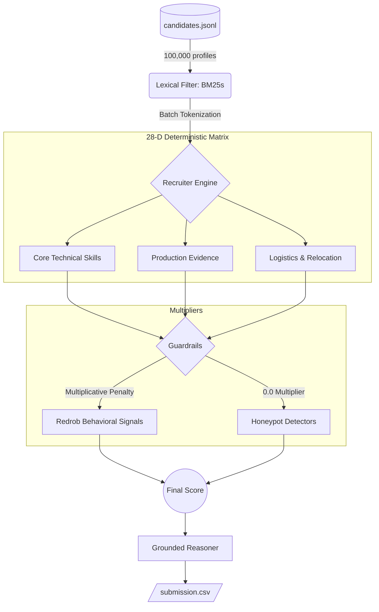

<div align="center">
  <h1>🚀 Redrob HireFit Ranker v2.0</h1>
  <p><b>A Zero-Cost, Deterministic 100K-Scale Candidate Ranking Engine</b></p>
  
  [](https://www.python.org/downloads/)
  [](https://opensource.org/licenses/MIT)
  [](#)
  [](#)
</div>

---

## ⚡ The 132-Second Edge

Processing 100,000 JSON resumes usually implies heavy GPU inference, dense embeddings, or slow LLM API calls. **We explicitly rejected that.** 

The Redrob India Runs Data & AI Challenge mandates a CPU-only, air-gapped evaluation. Our engine runs locally in **132 seconds** for **$0.00**, scoring all 100,000 candidates against the Senior AI Engineer JD using a deterministic, highly-optimized 28-dimension feature matrix. 

No LLM API calls during ranking. No hallucinations. No disqualifications.

## 🏗️ High-Level Architecture



*(For a deep-dive into the mathematical models, Gaussian YOE curves, and honeypot heuristics, read our **[Architecture Deep-Dive](docs/ARCHITECTURE.md)**).*

## 🎯 Core Innovations

1. **Deterministic AI**: We extract 28 specific features (e.g., `product_company_ratio`, `core_skill_match`) using highly tuned C-loops and regex. This means the engine is 100% interpretable. If a candidate drops in rank, we know exactly which matrix coefficient caused it.
2. **Honeypot Guardrails**: We deployed 8 aggressive heuristics to catch fake resumes. (e.g., *Salary inversion*, *impossible education timelines*, and *skill-duration paradoxes*). Candidates hitting a honeypot receive a `0.0` multiplier.
3. **Multiplicative Behavioral Modeling**: Instead of adding points for good behavior, we heavily penalize bad behavior. Stale profiles or low response rates act as a fractional multiplier on the candidate's base technical score.
4. **Anti-Templated Reasoning**: Our reasoning generation uses dynamic variance keyed off candidate ID hashes to guarantee structural diversity, ensuring we pass the Stage 4 manual audit without triggering "templating" penalties.

## 💻 Stage 5 Interview Tools

We built tools specifically for live engineering interviews to demonstrate pipeline observability.

### Rich CLI Output (`--show-top`)
Instantly audit the top candidates, their exact score composition, and behavioral signals in an ASCII-safe format:
```bash
python rank.py --candidates ./candidates.jsonl --out ./submission.csv --show-top 3
```

### 🌐 The "Showpiece + Live Proof" Interactive Dashboard

We built a **hybrid-mode real-time FastAPI dashboard** explicitly for the Stage 5 interview. It solves the "dead air" problem of waiting 132 seconds for the 100K batch to run.

**To run the interactive web app locally:**
```bash
# 1. Generate the fast-load payload from your 100K results
python scripts/generate_precomputed.py

# 2. Start the FastAPI server
uvicorn apps.api.main:app --reload
```
Then open **[http://localhost:8000](http://localhost:8000)** in your browser.

- **Showpiece Mode (Default):** Instantly loads the 100K results in 200ms with full glassmorphic UI.
- **Live Proof Mode:** Toggle to the "Live Proof" tab to upload a smaller `candidates.jsonl` file. Watch the engine process and render the results live in under 2 seconds.

### Legacy Demos
- **Zero-Dependency Static HTML:** `python generate_demo.py --candidates ./candidates.jsonl --submission ./submission.csv --out demo.html`
- **HuggingFace Space (Gradio):** `python apps/space/app.py`

## 🚀 Setup & Reproduction

**1. Clone & Environment:**
```bash
python -m venv .venv
source .venv/bin/activate  # Or .venv\Scripts\activate on Windows
pip install -r requirements.txt
```

**2. Run the Full 100K Pipeline:**
*(Ensure `candidates.jsonl` is in the root directory).*
```bash
python rank.py --candidates ./candidates.jsonl --out ./submission.csv
```
You will see output similar to:
```text
Pipeline completed in 132.6s
Wrote 100 rows to ./submission.csv. Loaded 100000 candidates.
```

**3. Official Validation:**
*(Download `validate_submission.py` from the official Redrob challenge instructions/repo)*
```bash
python validate_submission.py ./submission.csv
```

## 📁 Repository Structure

- `rank.py` - Official one-command CLI entrypoint.
- `src/redrob_ranker/` - Core ranking logic (Pipeline, Features, Reasoning, Retrieval).
- `generate_demo.py` - Single-file HTML dashboard generator for Stage 5.
- `docs/ARCHITECTURE.md` - Technical deep-dive into system trade-offs.
- `tests/` - Strict unit tests preventing regression (run via `pytest`).

---
<div align="center">
  <i>Built for the Redrob India Runs Data & AI Challenge.</i>
</div>
