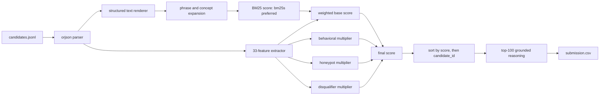

# Redrob HireFit Ranker Architecture

## Goal

Rank the top 100 candidates for the Redrob Senior AI Engineer JD while satisfying the official constraints:

- CPU-only execution.
- No network or hosted LLM/API scoring during ranking.
- Deterministic output.
- Full 100K reproduction in under 5 minutes.
- Validator-safe CSV output.

Final V6 measurement in the pinned python:3.11 image: `bm25s` ranks all 100,000
candidates in **136.0 s pipeline / 149.1 s wall** at 2 CPU / 16 GiB, with
sampled peak memory **4.13 GiB**, 53 honeypots detected and zero emitted
(`docs/runtime_matrix.md`).

## System Overview



## Why Not Hosted LLM Or Dense Embeddings?

Research supports a best-relevance pattern of retrieve, dense rerank, and cross-encoder/LLM
review — on real-world data, fine-tuned contrastive encoders beat BM25 by large margins
(ConFit v1-v3, RecSys '24 / arXiv:2502.12361). Those results shaped what we tested and what
we claim:

- **What we measured**: a static 32M-parameter encoder (model2vec/potion-retrieval-32M, the
  strongest class that fits the 300s CPU budget at 100K scale) scored **NDCG@10 +0.0000 at
  ~2.2x runtime** on this pool and was rejected by the pre-committed gate. On
  template-generated synthetic profiles, lexical coverage is near-complete, so the semantic
  headroom that ConFit exploits on real resumes is largely absent here.
- **What we did not measure**: fine-tuned transformer bi-encoders and cross-encoder/LLM
  rerankers. These are *infeasibility* claims, not measured negatives — a transformer pass
  over 100K candidates does not fit 300s on 2 CPUs (the 32M static model already cost 2.2x),
  and hosted scoring breaks offline reproducibility and Stage 3/4 auditability.

The official ranker therefore uses deterministic sparse expansion plus feature scoring.
Dense embeddings remain an opt-in, default-off experiment with a measured negative gate
result, not a dependency of the submitted path.

## Production Roadmap: Multilingual Normalization

The text normalizer in the official path is Latin-script only (`[^a-z0-9+#\s]` -> space),
which is correct for this challenge's English-only synthetic pool but deletes Devanagari and
other Indic scripts outright. For Bharat-scale deployment the swap is localized and the
architecture is script-agnostic: normalization and tokenization are isolated in
`text.py`/`features._norm`, so a Unicode-aware normalizer (NFKC fold + script-aware token
boundaries) plus per-language alias tables drop in without touching retrieval, feature
logic, guardrails, or the JD compiler. None of the committed artifacts depend on the
Latin-only behavior beyond this dataset.

## Retrieval Layer

The retrieval layer renders weighted structured text from:

- current title, headline, summary, location, and industry
- career titles, companies, industries, descriptions, and durations
- skill names, proficiency, endorsements, and duration
- education fields
- Redrob availability and platform signals

It then adds deterministic semantic concept markers for safe sparse recall:

- retrieval/search systems
- vector databases and ANN search
- RAG and agentic systems
- recommender/matching systems
- ranking/evaluation metrics

`bm25s` is preferred for speed; `rank-bm25` remains a fallback. BM25 is only one feature in the final score, not the final judge.

## 33-Feature Recruiter Matrix

The feature extractor produces stable values in `[0, 1]` for:

Skills:

- `core_skill_match`
- `jd_keyword_coverage_score`
- `nice_skill_match`
- `skill_depth_score`
- `endorsement_trust`
- `assessment_score_avg`
- `disqualifier_skill_flag`
- `keyword_stuffer_flag`
- `github_signal`

Career:

- `product_company_ratio`
- `consulting_only_flag`
- `ir_ranking_experience`
- `production_evidence`
- `title_match_score`
- `senior_title_held`
- `career_trajectory_score`
- `scale_signal`
- `code_writing_recent`

Experience:

- `yoe_fit_score`
- `education_score`
- `ml_ai_tenure_score`
- `open_source_signal`

Behavioral:

- `availability_score`
- `engagement_score`
- `responsiveness_score`
- `interview_reliability`
- `profile_quality`
- `notice_period_score`

Logistics:

- `location_score`
- `relocation_willing`

Role/context depth:

- `backend_depth_score`
- `data_bi_depth_score`
- `hyre_similarity`

## Scoring

```text
base_score = weighted(
  bm25_score,
  technical skills,
  production/retrieval evidence,
  product-company evidence,
  seniority,
  experience,
  logistics
)

final_score = base_score
            * behavioral_multiplier
            * honeypot_multiplier
            * disqualifier_multiplier
```

The model intentionally uses multipliers rather than only additive penalties. This mirrors recruiter reality: a strong technical profile can still be unusable if it is stale, unreachable, contradictory, or impossible.

## Guardrails

Hard honeypots receive `honeypot_multiplier = 0.0`:

- expert core skills with zero duration
- multiple current jobs
- impossible education timeline
- career timeline inconsistent with claimed experience
- too-short career history for claimed YOE
- title/description contradiction
- impossible notice period

Soft disqualifiers compound through `disqualifier_multiplier`:

- consulting-only career
- pure research without deployment evidence
- CV/speech/robotics-primary mismatch
- AI keyword stuffing without career support
- title hopping
- salary minimum greater than maximum
- endorsement inflation with low profile quality

The consulting-only penalty is softened when the candidate has strong production evidence, because Indian services companies can still contain strong product/platform builders.

## Reasoning

Reasoning is deterministic and grounded:

- It mentions only facts present in the candidate JSON or feature values.
- Top ranks emphasize JD-aligned strengths.
- Lower ranks include honest concern tone.
- Candidate ID controls deterministic wording variation so output is reproducible without identical templates.

The dashboard uses `CandidateFeatures` directly for flags, multipliers, and honeypot reasons. It does not infer guardrails by searching the reasoning text.

## Validation

Verified gates:

```bash
python -m compileall -q src tests rank.py apps scripts
python -m pytest -q
PYTHONHASHSEED=0 python rank.py --release --candidates ./candidates.jsonl --out ./submission.csv --workers 2
python scripts/validate_submission.py submission.csv
# Also run the official challenge validator from the downloaded bundle when available.
```

Final measured output:

```text
Runtime: 136.0s pipeline / 149.1s wall at 2 CPU / 16 GiB
Sampled peak container memory: 4.13 GiB
Loaded candidates: 100000
Ranked pool: 100000
Rows emitted: 100
BM25 backend: bm25s
Hard honeypots detected: 53
Hard honeypots in output: 0
```

## V6 release envelope

`--release` requires the exact official input SHA-256, verified NumPy model,
deterministic hash/BLAS settings and BM25s backend. It validates full-pool,
row, integrity and output-hash invariants before an atomic publish. Expensive
work stays container-local, so a forced OOM preserves the previous output and
leaves zero mounted temporary files.
